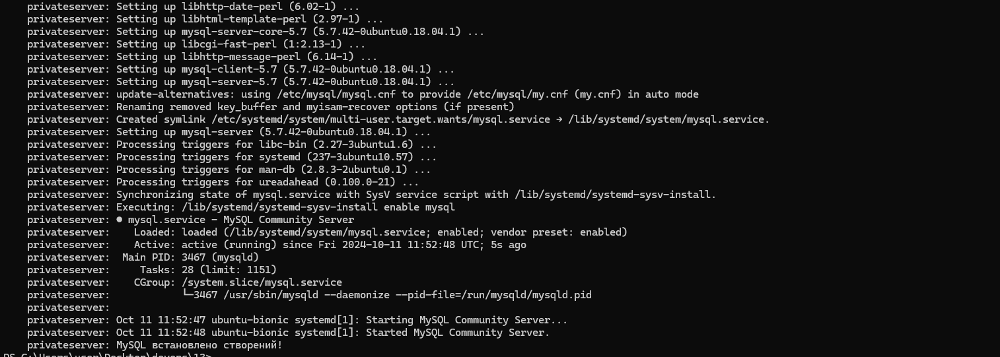
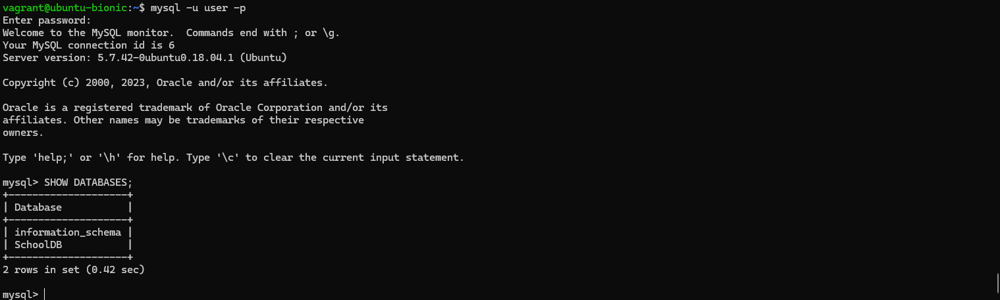
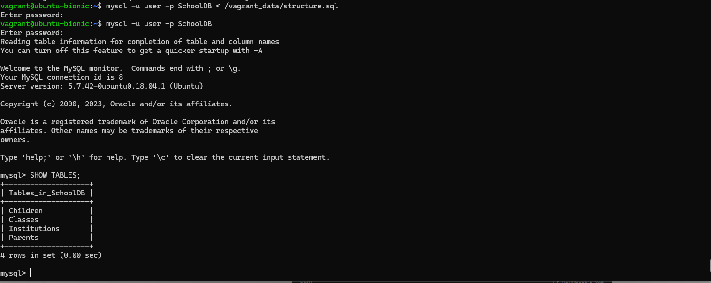
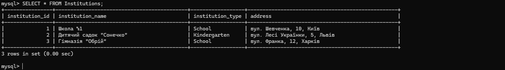
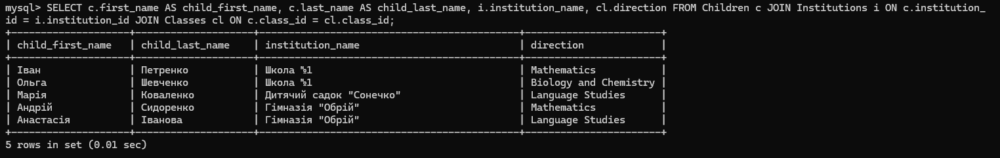
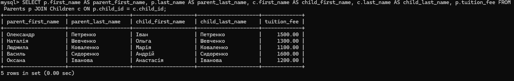
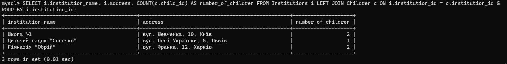
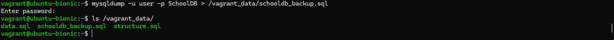
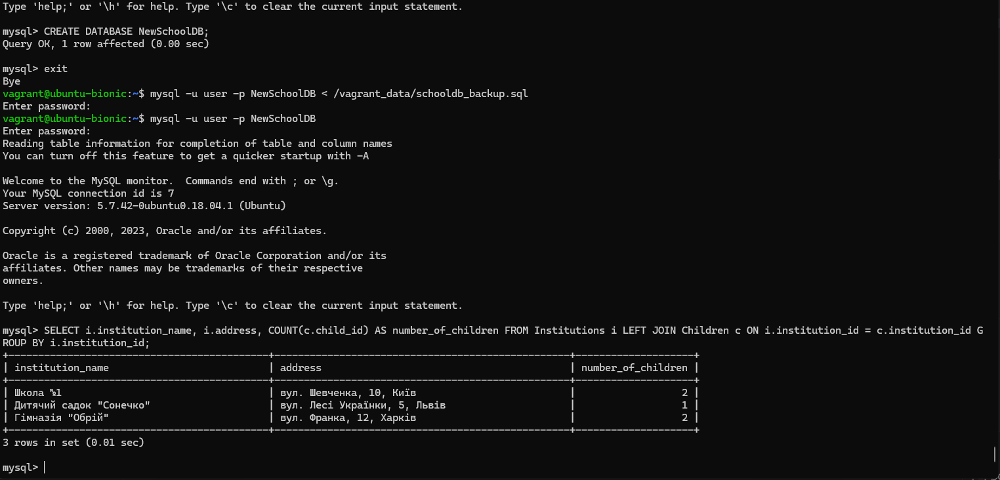

# SQL

## 1. Створення серверу та встановлення MySQL

## 2. Створення структури таблиць за допомогою скрипта ./data/structure.sql та виконання його на сервкрі mysql -u user -p SchoolDB < /vagrant_data/structure.sql

## 3. Наповнення таблиць даними за допомогою скрипта ./data/data.sql та виконання його на сервкрі mysql -u user -p SchoolDB < /vagrant_data/data.sql

## 4. Виконання запитів:

### 1. Список всіх дітей разом із закладом, в якому вони навчаються, та напрямом навчання в класі:

#### SELECT c.first_name AS child_first_name, c.last_name AS child_last_name, i.institution_name, cl.direction FROM Children c JOIN Institutions i ON c.institution_id = i.institution_id JOIN Classes cl ON c.class_id = cl.class_id;

### 2. Інформація про батьків і їхніх дітей разом із вартістю навчання:

#### SELECT p.first_name AS parent_first_name, p.last_name AS parent_last_name, c.first_name AS child_first_name, c.last_name AS child_last_name, p.tuition_fee FROM Parents p JOIN Children c ON p.child_id = c.child_id;

### 3. Список всіх закладів з адресами та кількістю дітей, які навчаються в кожному закладі:

#### SELECT i.institution_name, i.address, COUNT(c.child_id) AS number_of_children FROM Institutions i LEFT JOIN Children c ON i.institution_id = c.institution_id GROUP BY i.institution_id;

## 5. Створення бекапу БД та розгортання нової БД на основі бекапу:

### mysqldump -u user -p SchoolDB > /vagrant_data/schooldb_backup.sql (для створення бекапу потрібно змінити права user під root користувачем)

### Підєднавшись до mysql, створив нову БД NewSchoolDB (CREATE DATABASE NewSchoolDB;). Зробив mysql -u user -p NewSchoolDB < /vagrant_data/schooldb_backup.sql та перевірив запит SELECT i.institution_name, i.address, COUNT(c.child_id) AS number_of_children FROM Institutions i LEFT JOIN Children c ON i.institution_id = c.institution_id GROUP BY i.institution_id;

