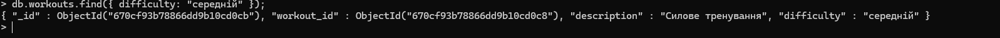

# NoSQL

## 1. Створення серверу та встановлення MongoDB

### Для встановлення MongoDB використав версію 4.4 та ubuntu/bionic64

## 2. Створення БД gymDatabase та колекцій clients, memberships, trainers, workouts

### use gymDatabase;

### db.createCollection("clients");

### db.createCollection("memberships");

### db.createCollection("workouts");

### db.createCollection("trainers");

## 3. Створення схеми для кожної з колекції по прикладу:

## 4. Добавив рандомні дані до колекцій:

## 5. Запити:

### - Знайдіть всіх клієнтів віком понад 30 років:

### - Перелічіть тренування із середньою складністю:

### - Покажіть інформацію про членство клієнта з певним client_id:

