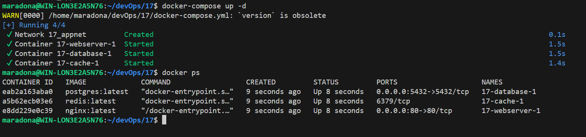
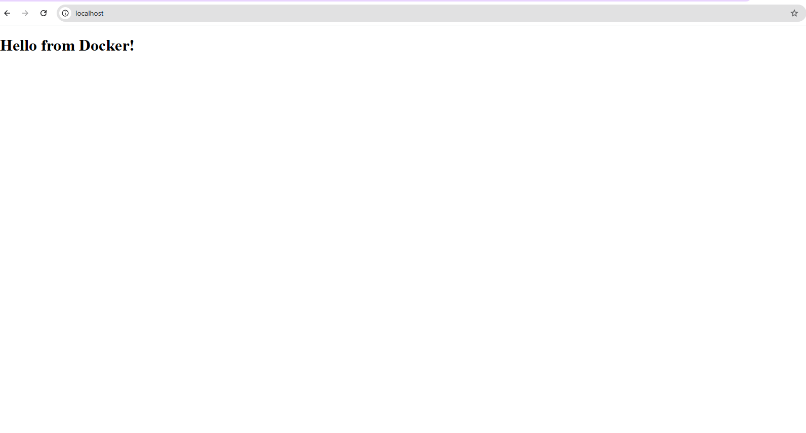
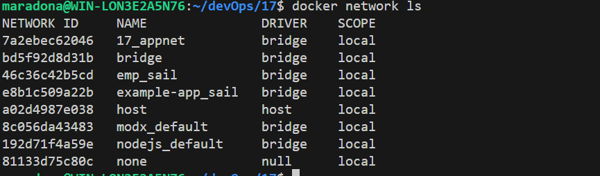
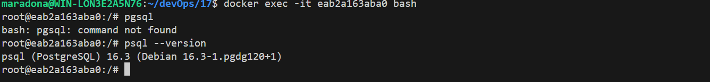
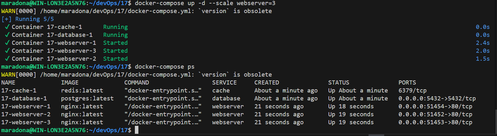

# Docker-compose

## 1. Встановив Docker на Windows

## 2. Створив файл docker-compose.yml з трьома сервісами webserver, database та cache.

## 3. Запустив всі сервіси за допомогою команди docker-compose up -d та перевірив стан їх роботи командою docker ps. Відкрив http://localhost/ в браузері.

## 4. Перевірив мережі та томи за допомогою команд docker network ls та docker volume ls. Підєднався до контейнера БД PostgreSQL за допомогою команди docker exec -it

## 5. Для запуску трьох екземплярів вебсервера використав команду docker-compose up -d --scale webserver=3. Як результат запустилось 3 webservers, з можливістю відкрити сторінки за адресами: http://localhost:51452/, http://localhost:51453/, http://localhost:51454/.

