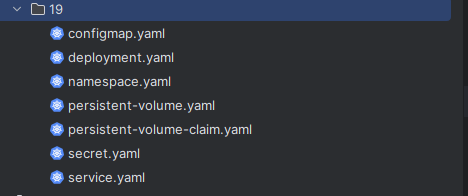
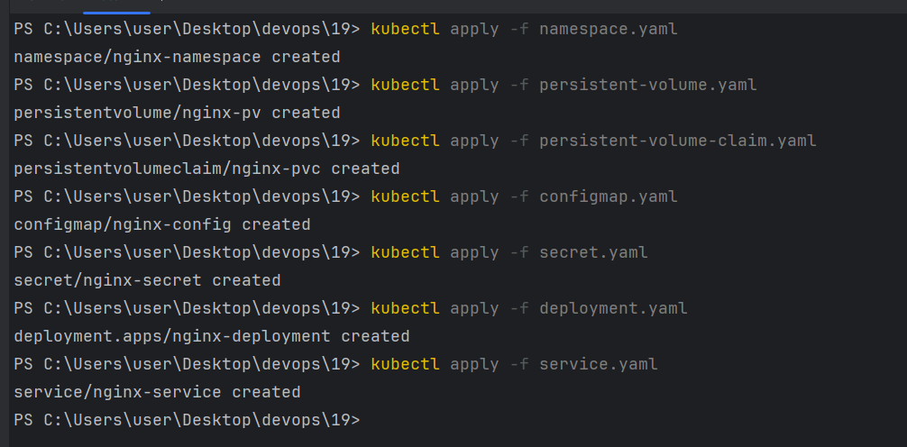
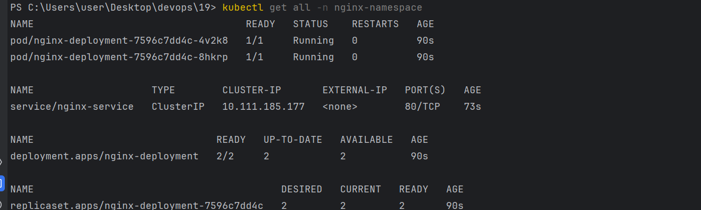
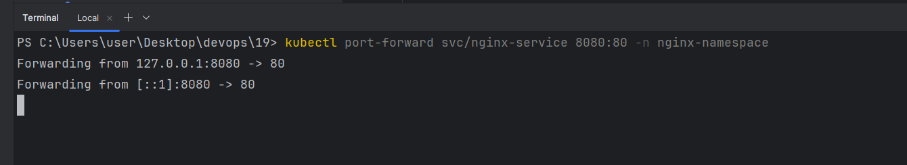
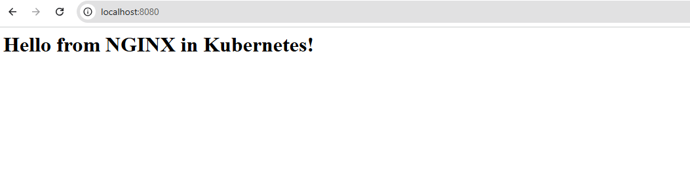

# K8S

## 1. Встановив minikube на Windows

## 2. Створив файли для створення різних абстракцій.

## 3. Створив об'єкти, запустивши конфігураційні файли.

## 4. Перевірив рузультат, запустилися 2 pods

## 5. Зробив прокидання портів та відкрив сторінку в браузері.

