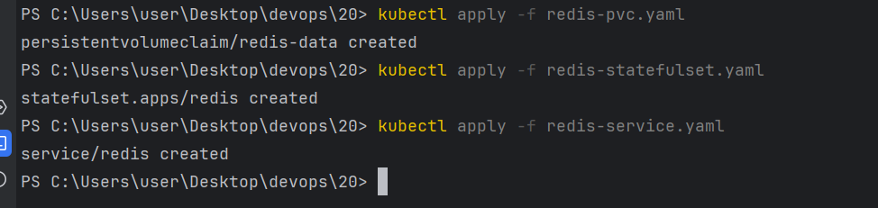
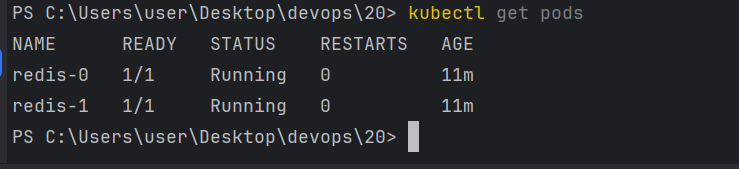
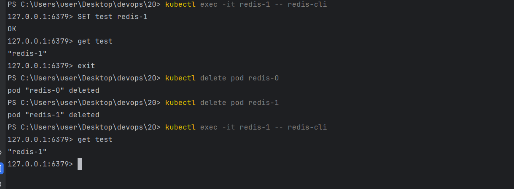
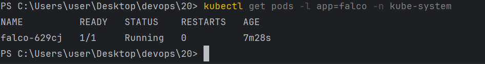
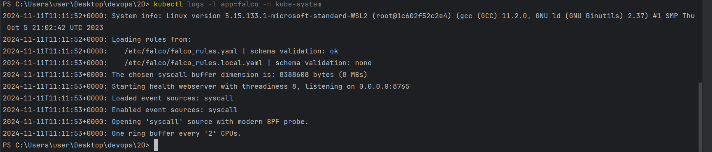

# K8S

## 1. Створення StatefulSet для Redis-кластера

### - Створив конфігураційні файли redis-pvc.yaml, redis-statefulset.yaml та redis-service.yaml.

### - Запустив файли в терміналі.

### - Поди запустилися та мають імена redis-0 та redis-1.

### - Зробив перевірку чи зберігаються дані після вилучення подів. Зберігаються, все працює коректно.

## 2. Налаштування Falco в Kubernetes за допомогою DaemonSet

### - Створив конфігураційний файл falco-daemonset.yaml та запустив його.

### - Перевірив запущені поди Falco.

### - Перевірив логи.

