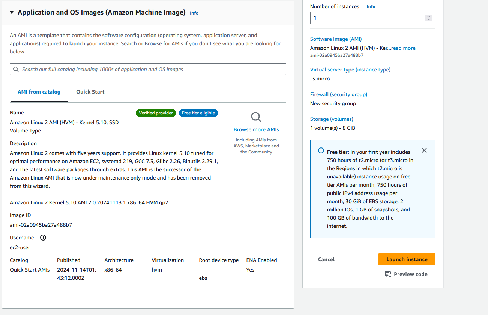
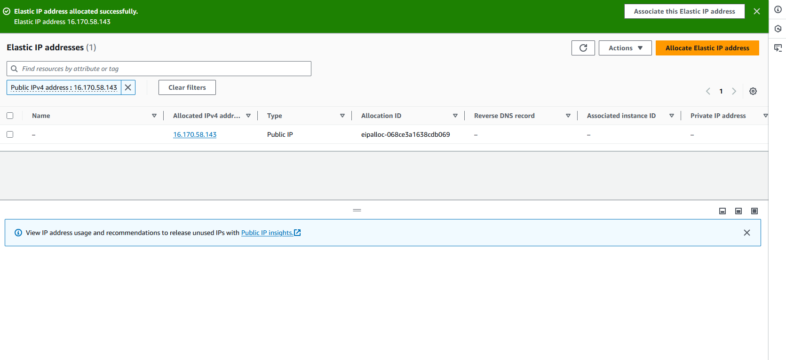

# AWS - Basic

## 1. Створення та налаштування VPC

### - Створив через консоль AWS VPC з однією публічною та приватною підмережами.

## 2. Налаштування груп безпеки (Security Groups)

## 3. Запуск інстансу EC2

### - Створив інстанс EC2 Amazon Linux 2 AMI з типом t3.micro.

### - Прив'язав до публічної мережі.

### - Створив SSH-ключ для доступу до інстансу.

## 4. Призначення еластичної IP-адреси (EIP)

### - Створив нову EIP в AWS консолі та прив'язав до створеного інстансу.

### - Додав в Security Groups правило All ICMP - IPv4, щоб можна було зробити psng.

