# AWS - EKS

## 1. Створення кластеру EKS

### - встановлення eksctl:

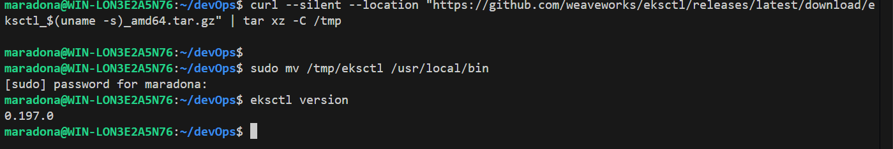

### - створення кластеру за допомогою CLI:

#### eksctl create cluster --name bro-eks-cluster --version 1.27 --region eu-north-1 --nodegroup-name bro-workers --node-type t3.medium --nodes 2 --nodes-min 2 --nodes-max 4 --managed

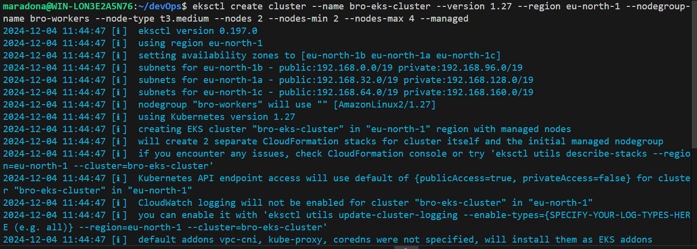
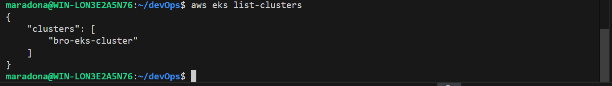
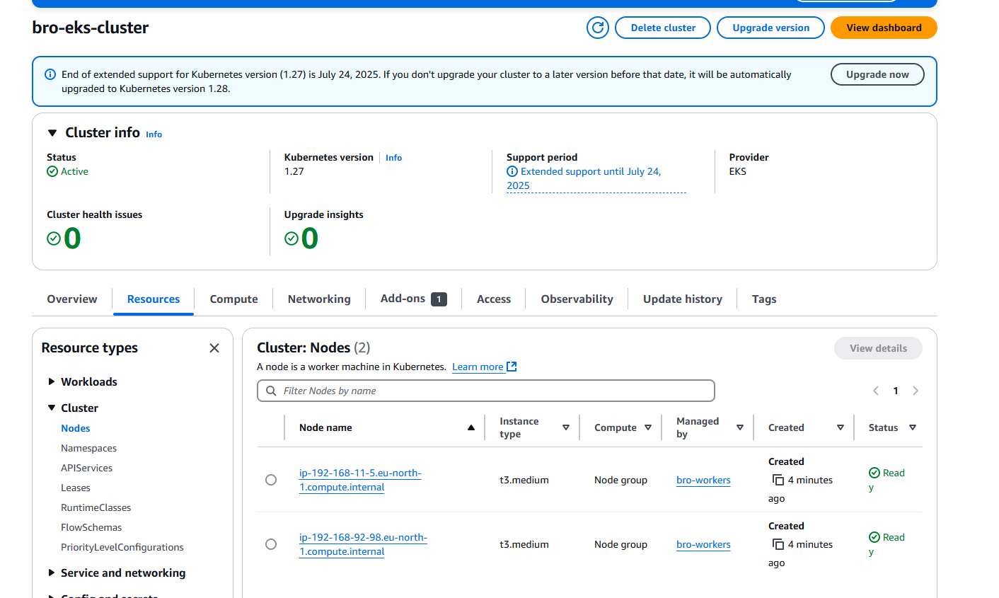
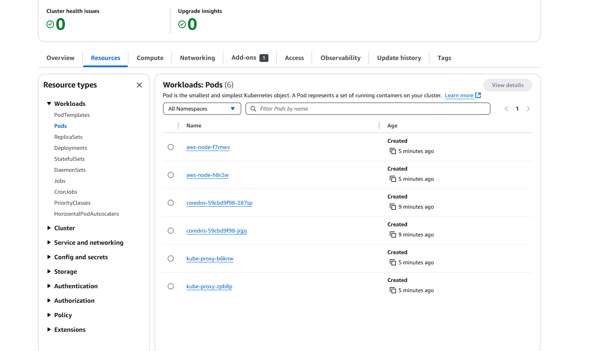

## 2. Налаштування kubectl для доступу до кластера

### - aws eks update-kubeconfig --region eu-north-1 --name bro-eks-cluster

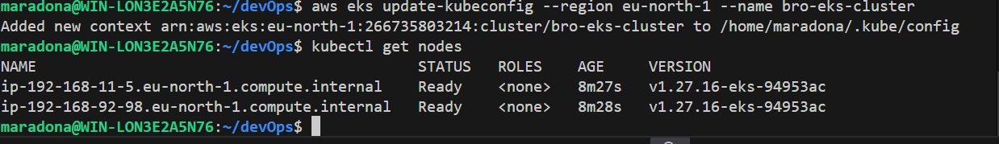

## 3. Розгортання статичного вебсайту

### - Створення deployment.yaml, configmap.yaml та service.yaml.

### - kubectl apply -f configmap.yaml

### - kubectl apply -f deployment.yaml

### - kubectl apply -f service.yaml

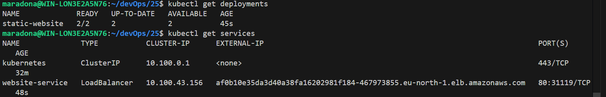
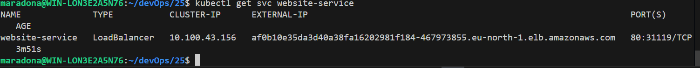
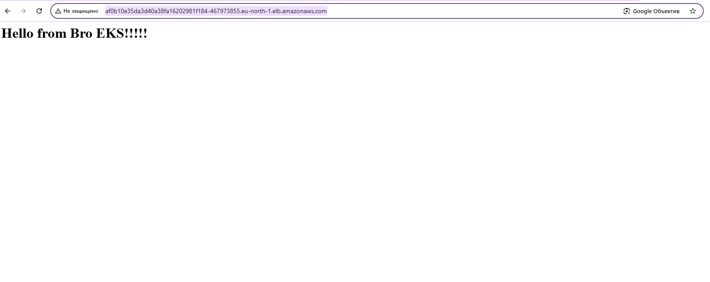

## 4. Створення PersistentVolumeClaim для збереження даних.

### - Створення storageclass.yaml, pv.yaml та pvc.yaml.

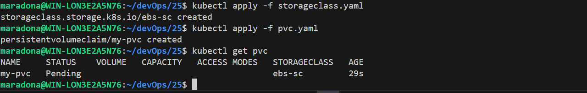

### - Створення Pod, що використовує VPC за допомогою файлу pod.yaml. Pod створилася, але чомусь не змогла приєднати my-pvc.

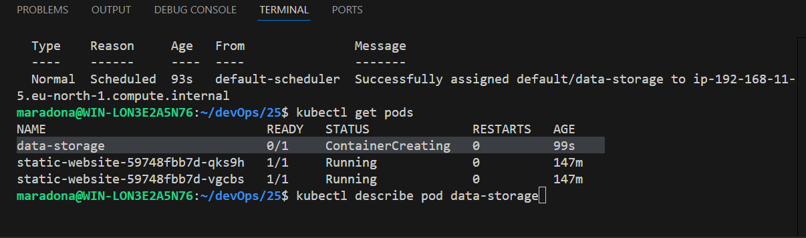
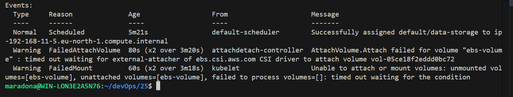

## 5. Запуск завдання за допомогою Job

### - Створення job.yaml та його запуск.

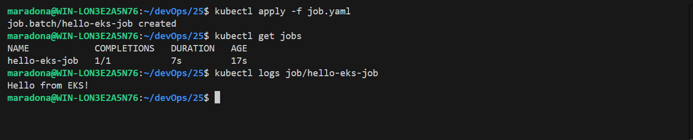

## 6. Розгортання тестового застосунку

### - Створення deployment-app.yaml та service-app.yaml.

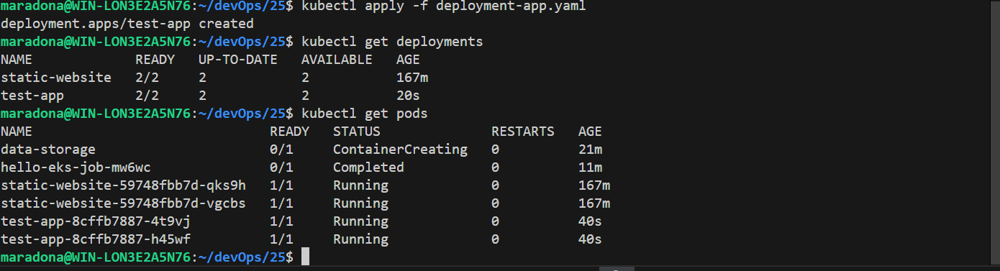
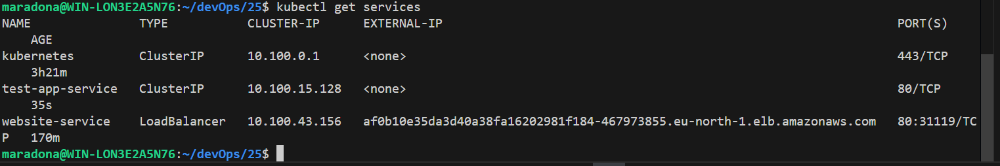
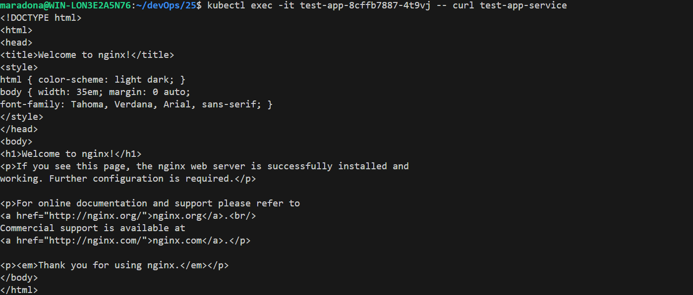

## 7. Створення namespace

### - Створення namespace.yaml та його запуск kubectl apply -f namespace.yaml.

### - Створення dev-deployment.yaml та його запуск kubectl apply -f dev-deployment.yaml.

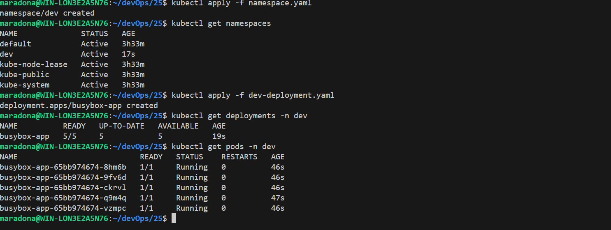

## 8. Очистка ресурсів

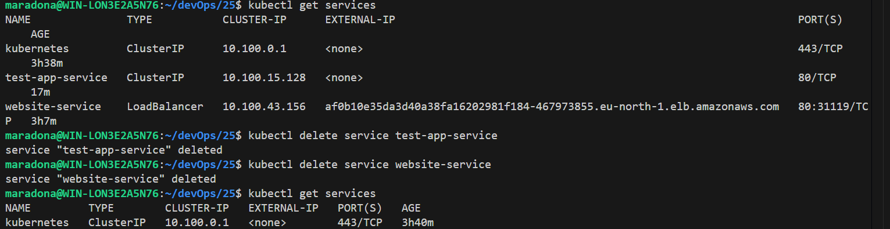
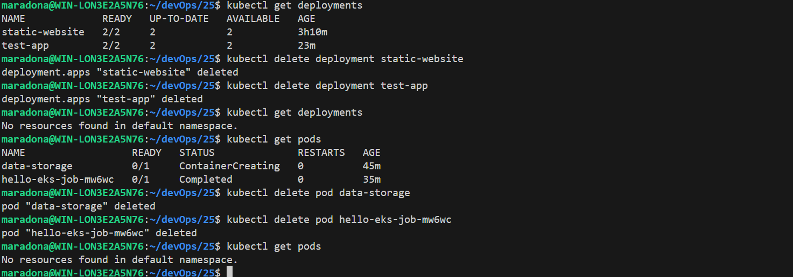

### - Видалення кластера eksctl delete cluster --name bro-eks-cluster --region eu-north-1
