# AWS - RDS

## 1. Створення RDS інстансу в приватній підмережі.

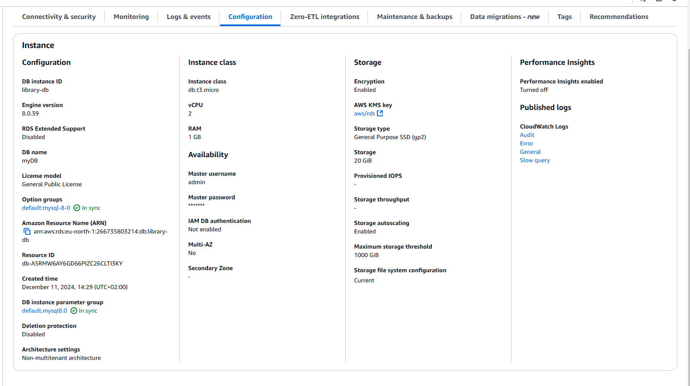

## 2. Створення Bastion host в публічній підмережі для доступу до БД.

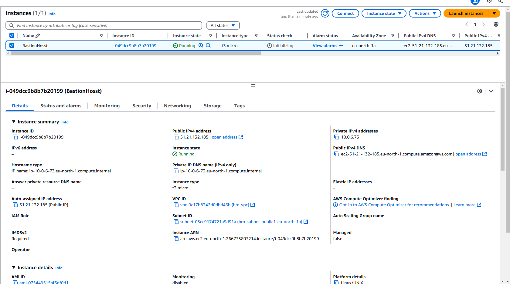

## 3. Підключення до БД через Bastion host та прокидання портів.

### - ssh -i "aws.pem" -L 3306:library-db.czi6k4ceafb1.eu-north-1.rds.amazonaws.com:3306 ubuntu@ec2-51-21-132-185.eu-north-1.compute.amazonaws.com

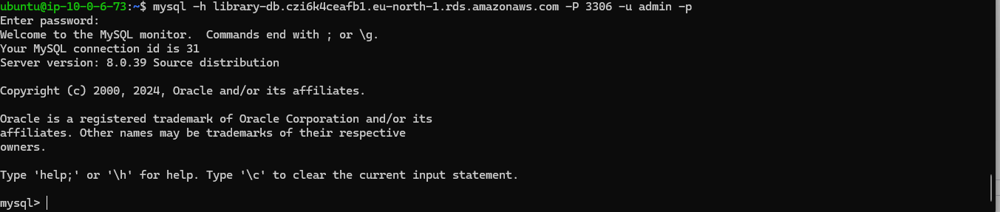
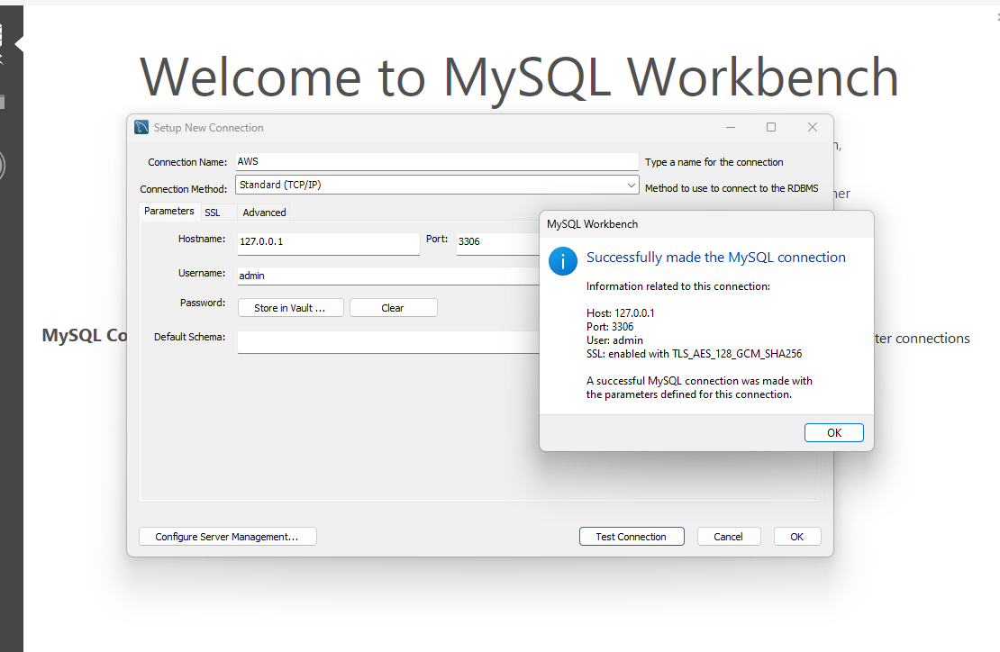
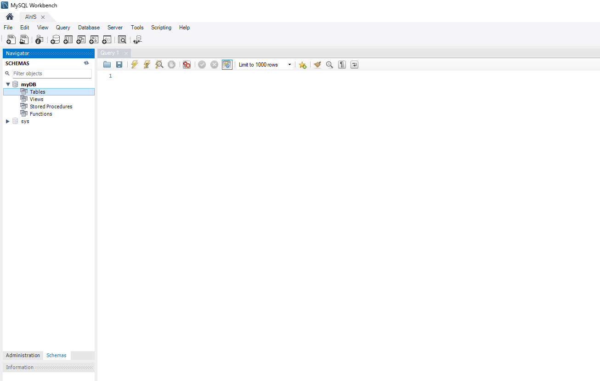

## 4. Створення БД libary, таблиць та наповнення їх даними.

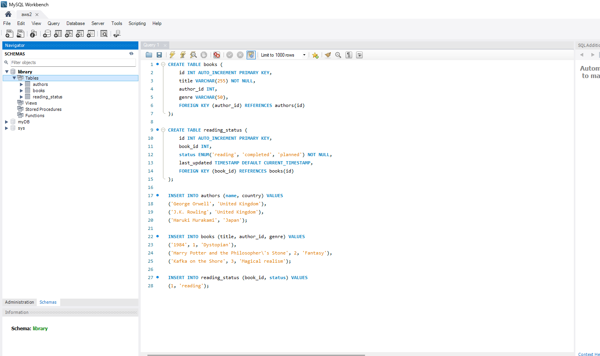

## 5. Виконання запитів

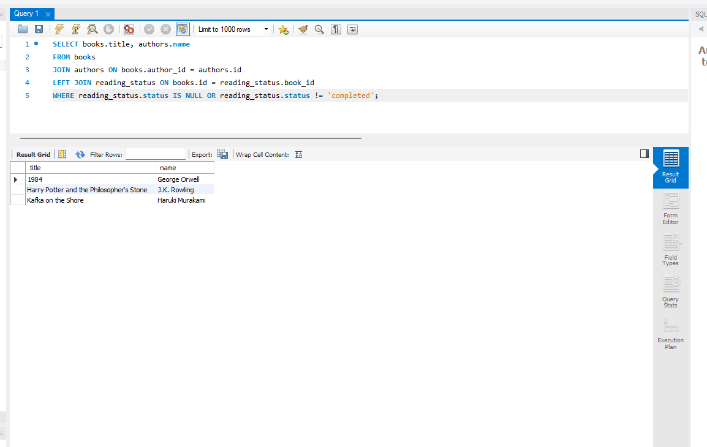
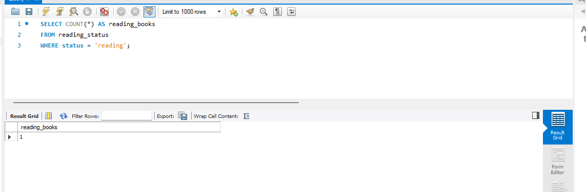

## 5. Налаштування доступу

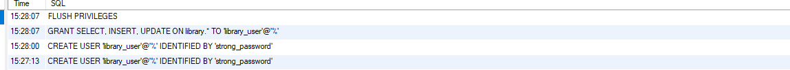

## 7. Моніторинг та резервне копіювання

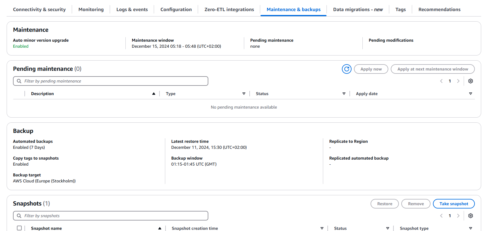
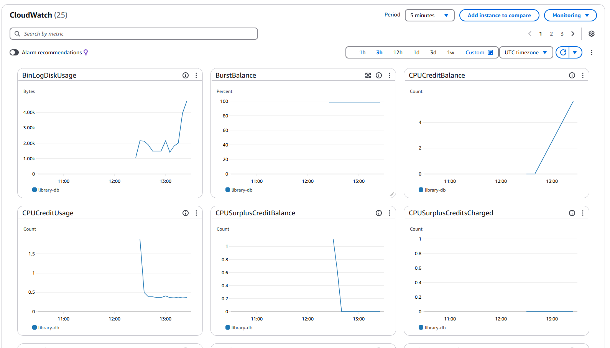
