# VirtualBox

1. Встановлення VirtualBox:
   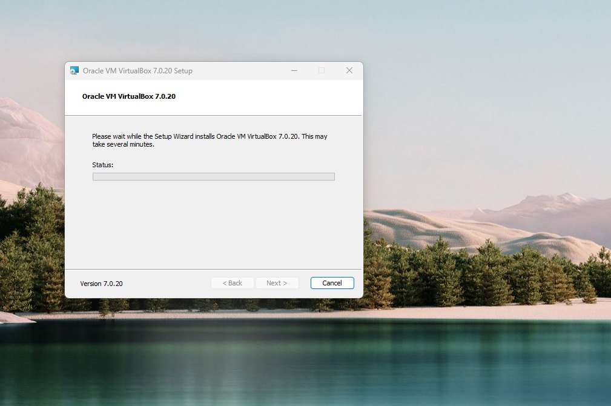

2. Створення нової віртуальної машини:
   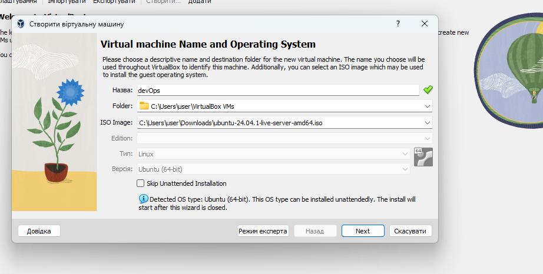
   

3. Налаштування VM:
   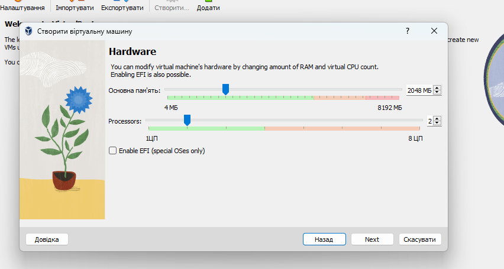
   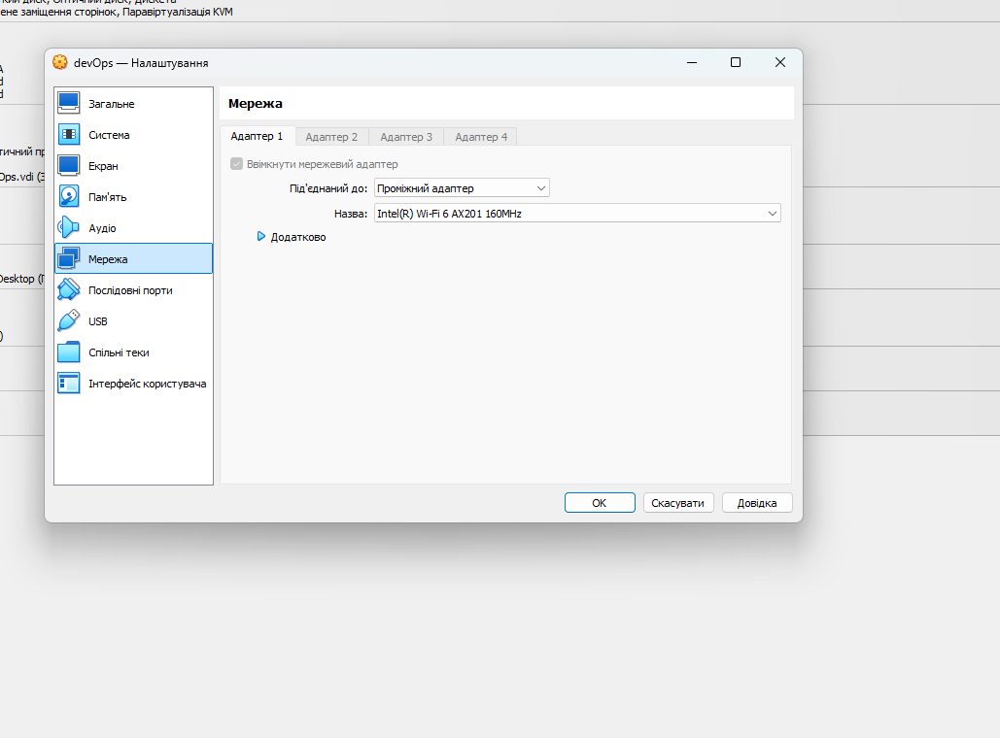

4. Інсталяція операційної системи:
   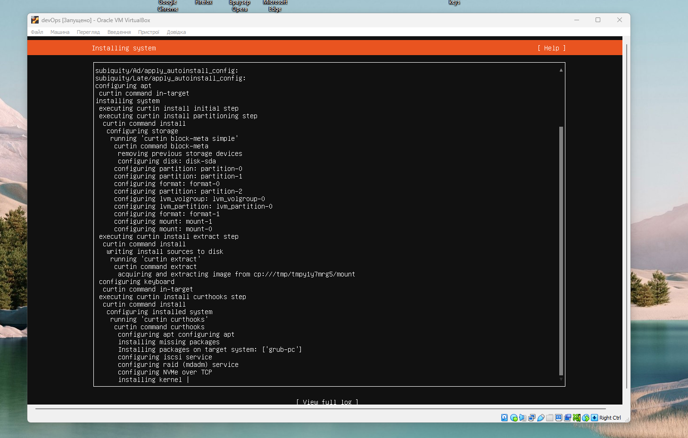
   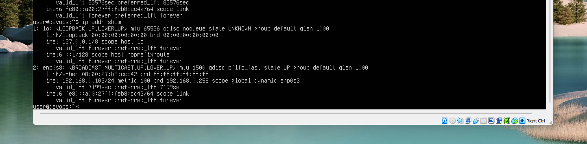
   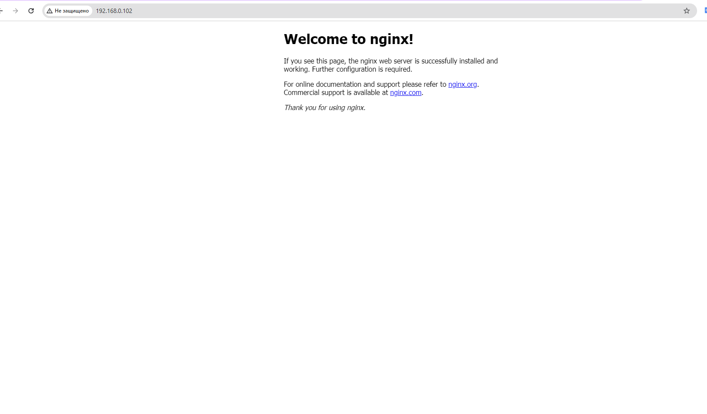

5. Збереження та відновлення стану VM:
   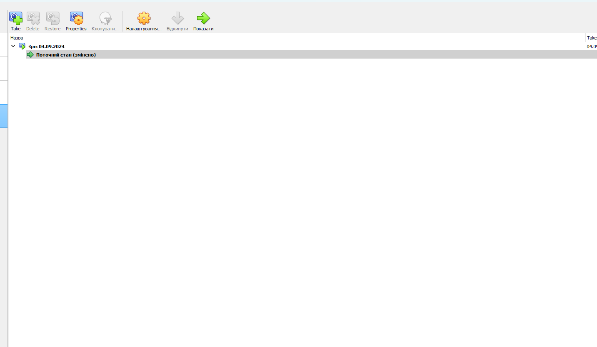
   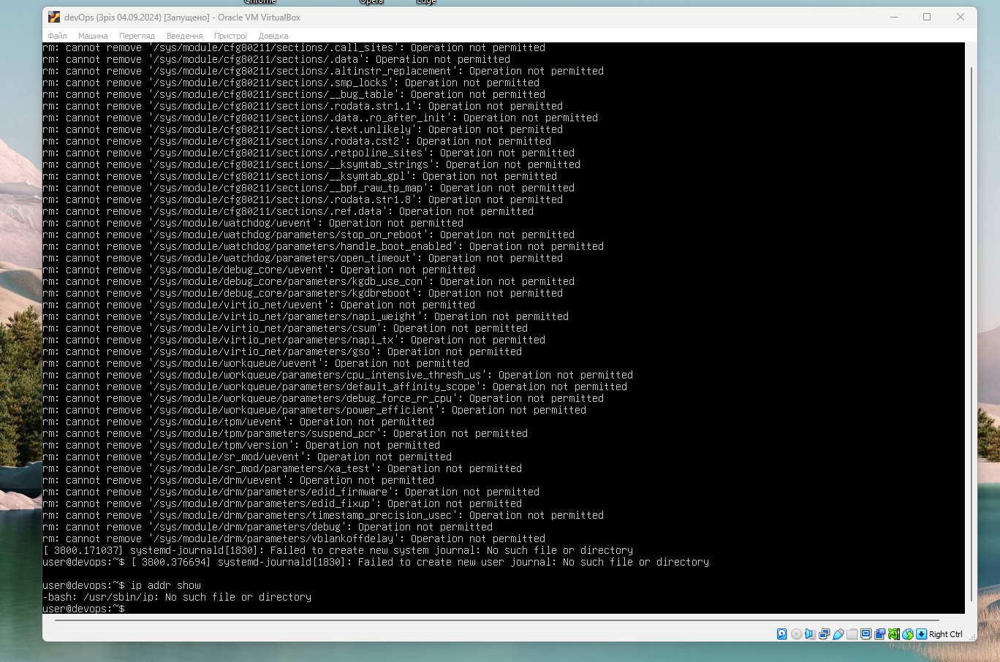
   
   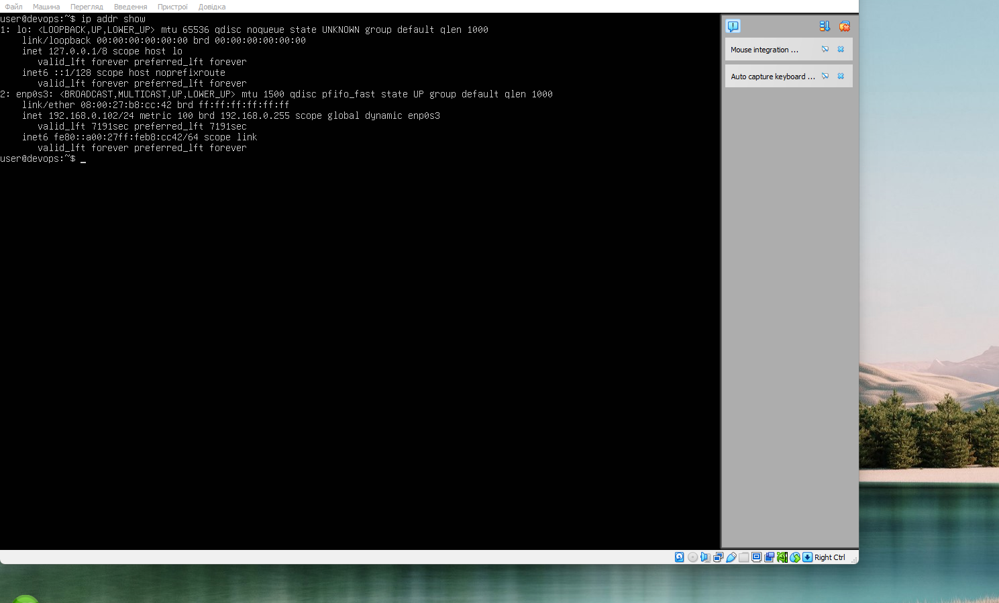

6. Зміна параметрів віртуальної машини через графічний інтерфейс:
   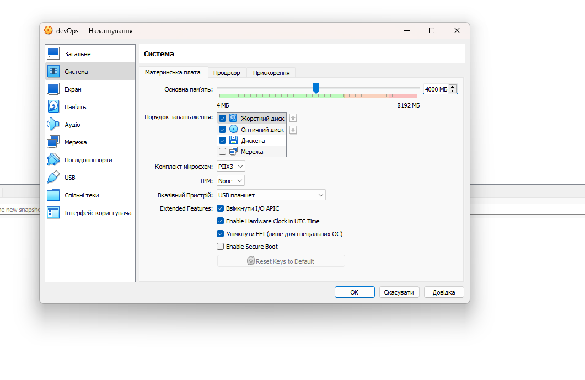
   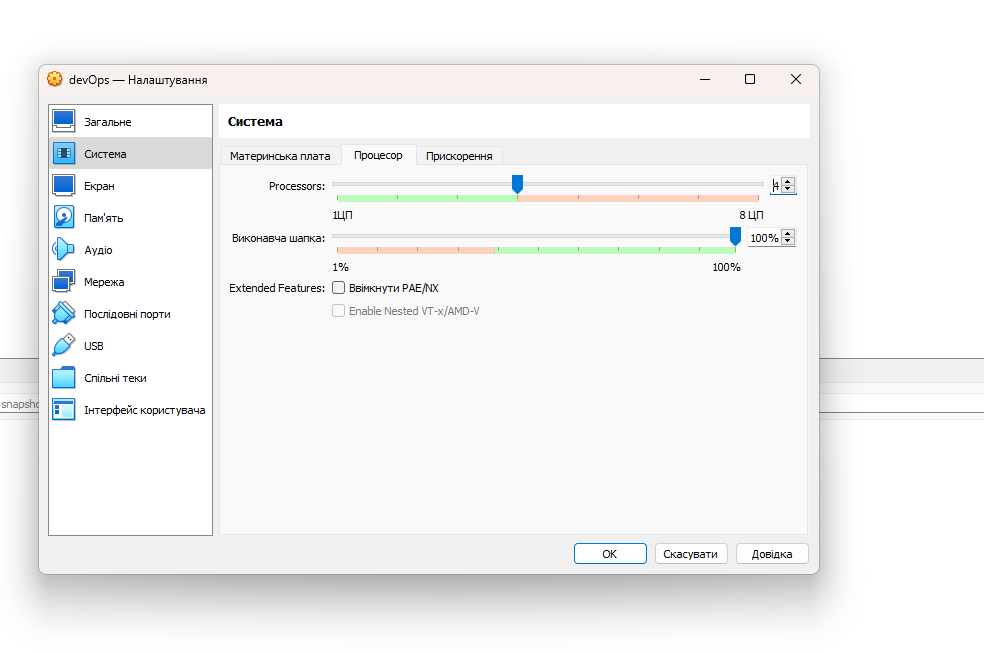

7. Вимкнення та видалення VM:
   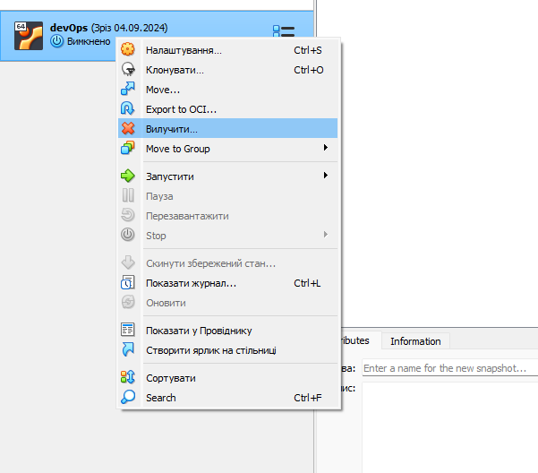
