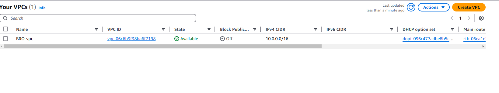
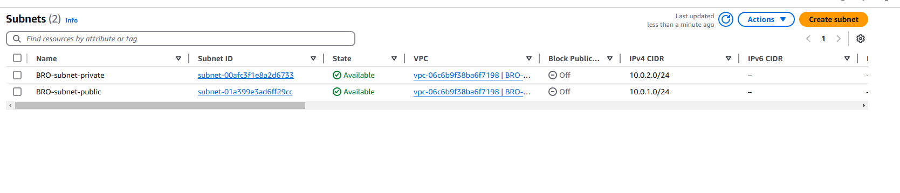
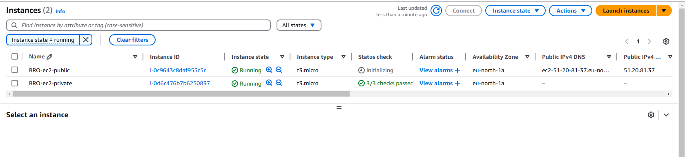
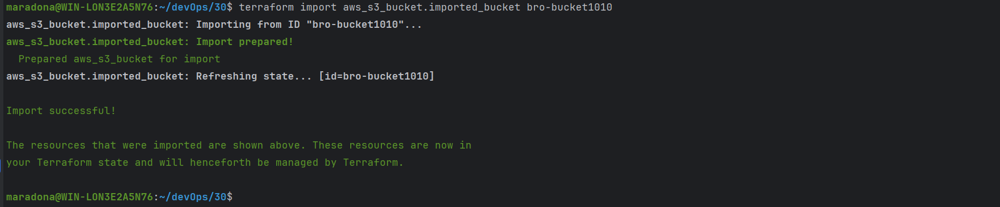
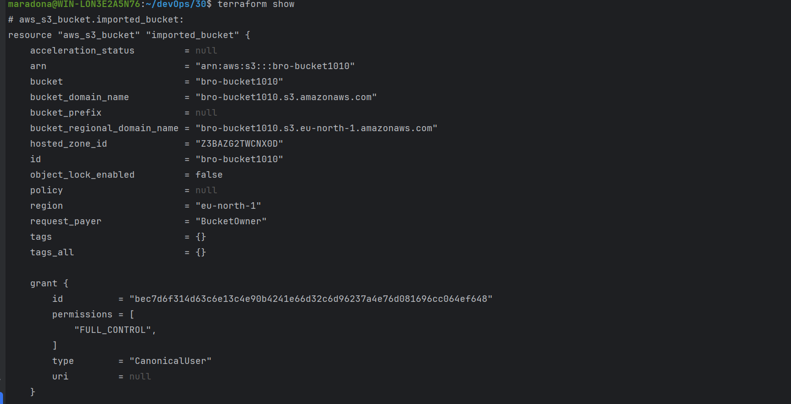
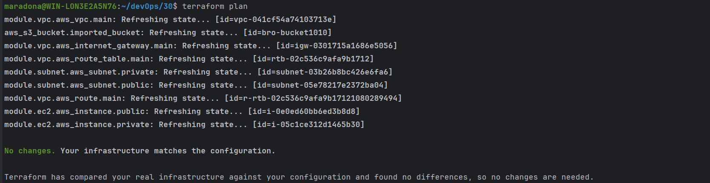
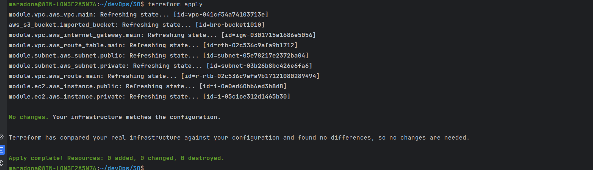

# AWS - Advanced Terraform

## 1. Створив три модулі в папці modules: vpc, subnet, ec2.
### - Виконав команду "terraform init", "terraform fmt", "terraform validate" та "terraform apply".

### - Видалив створені ресурси командою "terraform destroy".

## 2. Створив в AWS console S3 bucket "bro-bucket1010".
### - Додав ресурс S3 bucket до main.tf.
### - Виконав команду terraform import aws_s3_bucket.imported_bucket bro-bucket1010.

### - Перевірив атрибути ресурсу "terraform show".

### - Перевірив план "terraform plan".

### - Виконав "terraform apply".

## 3. Видалив всю інфраструктуру, в тому числі і S3 bucket, за допомогою команди "terraform destroy".