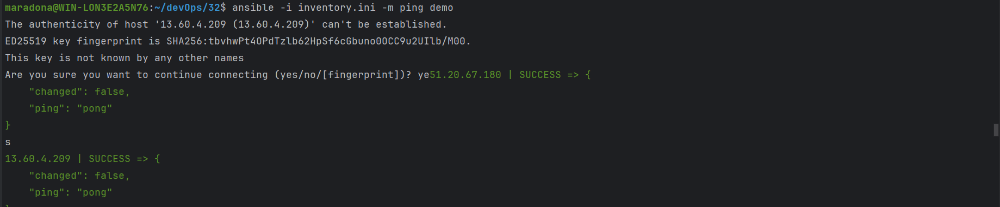
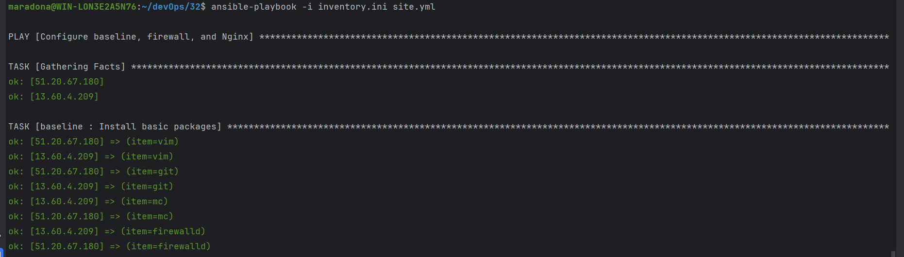
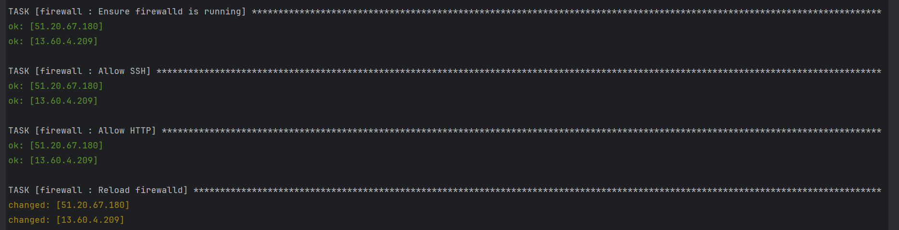
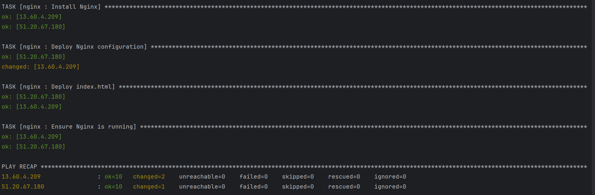
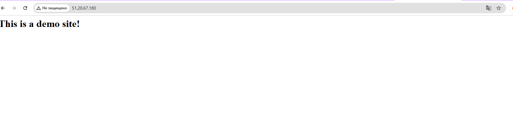

# AWS - Ansible

## 1. Створення ролі "baseline" для базових налаштувань серверів.
### 1) Налаштування SSH-ключів.
#### - За допомогою terraform створив два сервери на AWS.
#### - В файлі inventory.ini зробив налаштування до цих серверів та за допомогою модуля ping перевірив доступ.

### - Встановлення базових пакетів (vim, git, mc, ufw).
#### - За допомогою команди ansible-galaxy init roles/baseline створив відповідну роль та описав порядок встановлення необхідних пакетів в tasks/main.yml.

## 2. Створення ролі для налаштування firewall.
#### - За допомогою команди ansible-galaxy init roles/firewall створив відповідну роль та описав порядок необхідних дій в tasks/main.yml.

## 3. Створення ролі для налаштування Nginx.
#### - За допомогою команди ansible-galaxy init roles/nginx створив відповідну роль та описав порядок необхідних дій в tasks/main.yml.
#### - В templates/ додав 2 файли: index.html.j2 та nginx.conf.j2 (Стартова сторінка та налаштування сервера).
#### - В defaults/main.yml додав дві змінні, які вивів на головній сторінці.

