# AWS - Jenkins

## 1. Налаштувати EC2 серверів.
### - За допомогою terraform створив 3 сервери: app, jenkins-master та jenkins-worker;
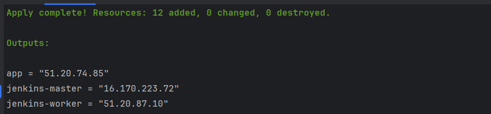
### - За допомогою ansible на jenkins-master встановлюю Jenkins, на jenkins-worker - Java, на app - docker та docker-compose;
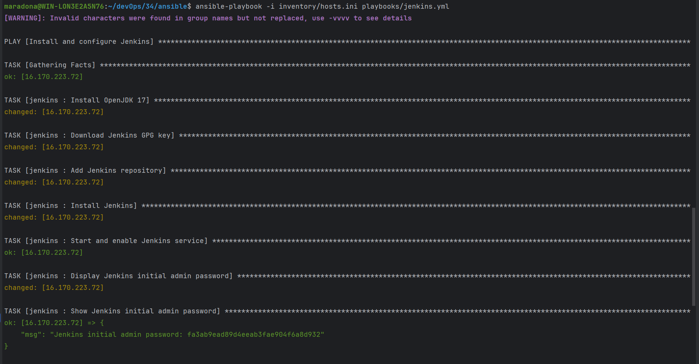
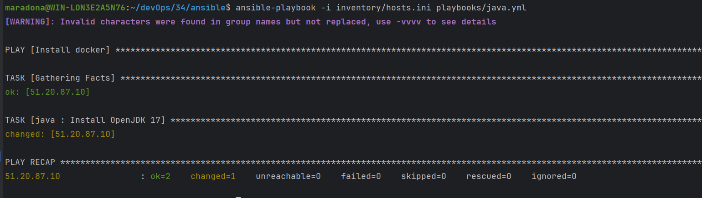
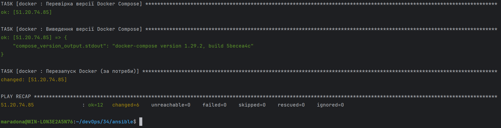

## 2. Деплой та налаштування Jenkins.
- Встановлення плагинів та налаштування jenkins-master;
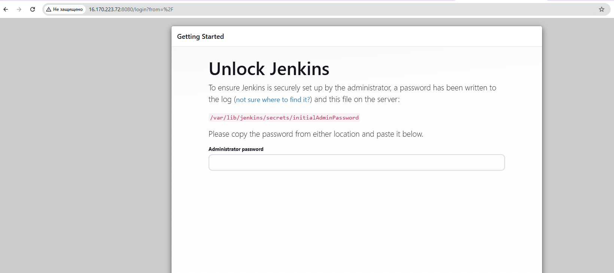
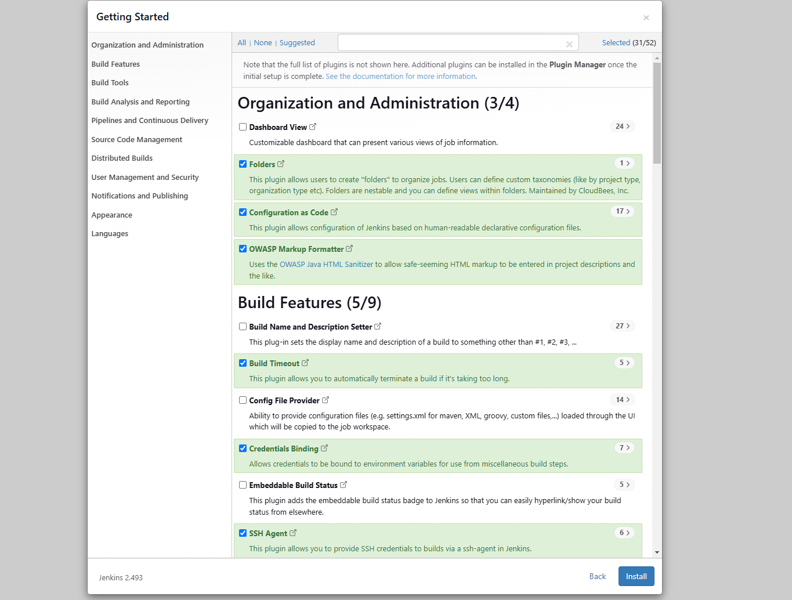
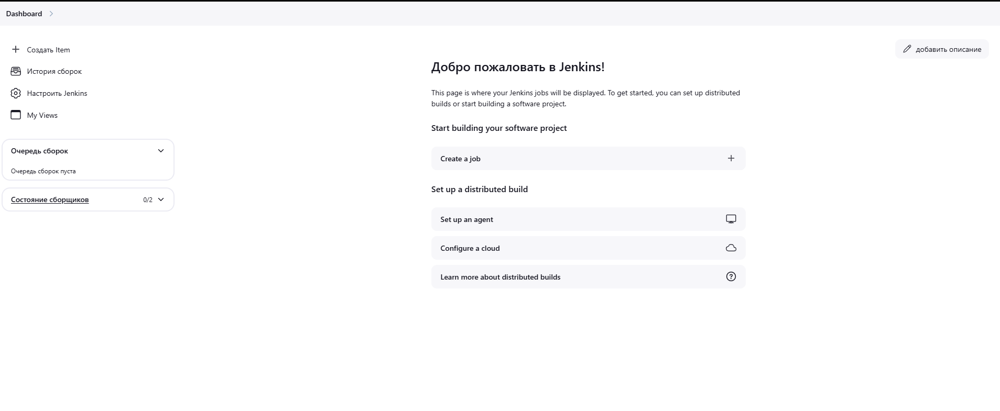
- Налаштування jenkins-worker та під'єднання його до jenkins-master;
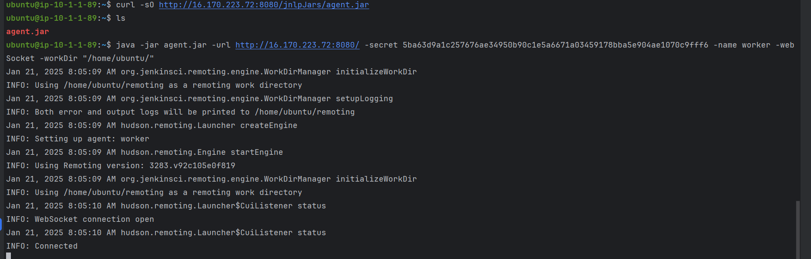
##  3. Налаштувати Freestyle Job.
- Налаштував СІ для репозиторія з проєктом на GitLab - https://gitlab.com/ukrgorban/catalogbooks;
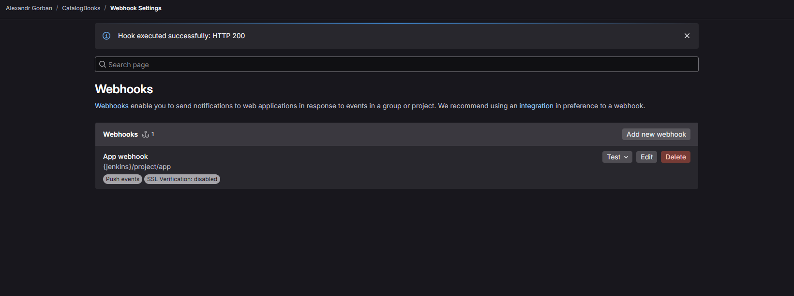
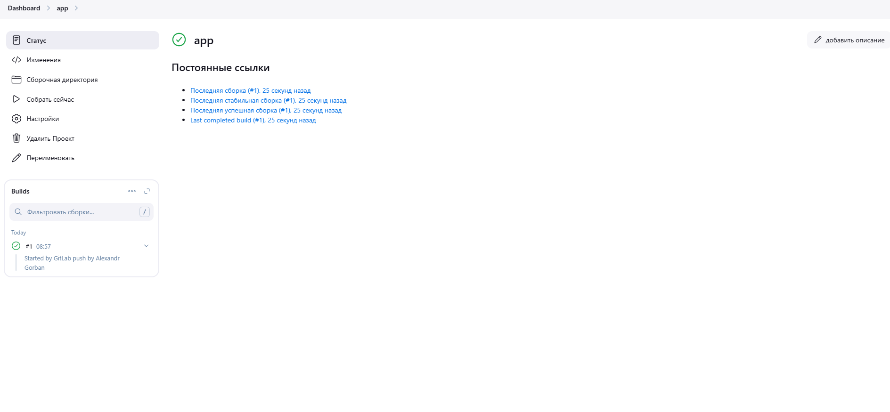
- Налаштував СD, в результаті чого запустилося 4 контейнери (frontend для каталогу книг, pg-admin для адміністрування postgres);
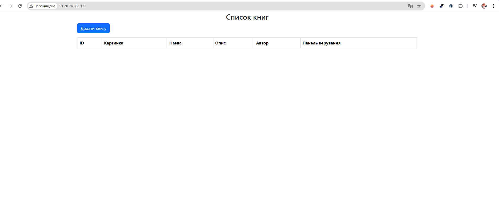
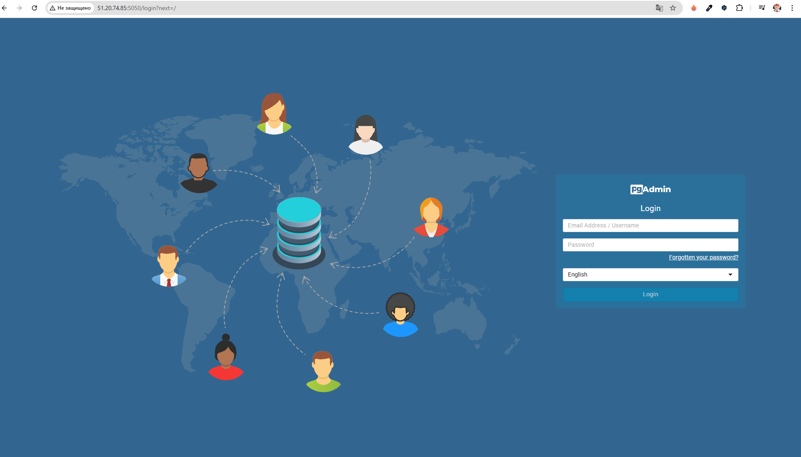
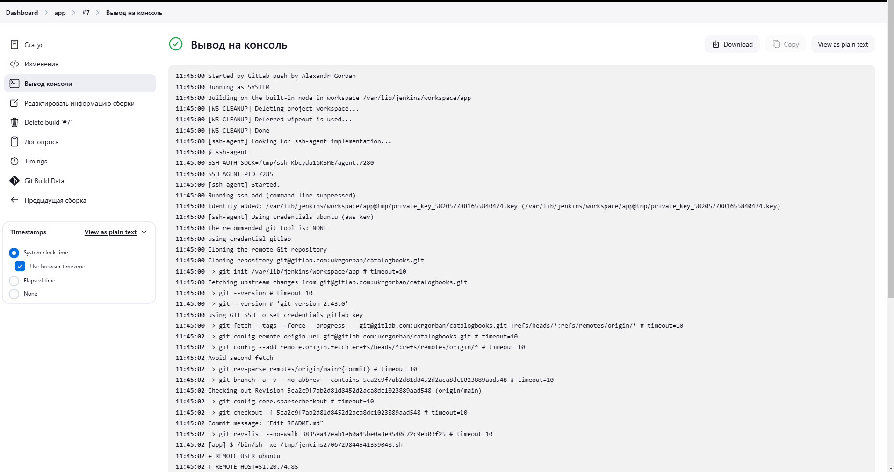
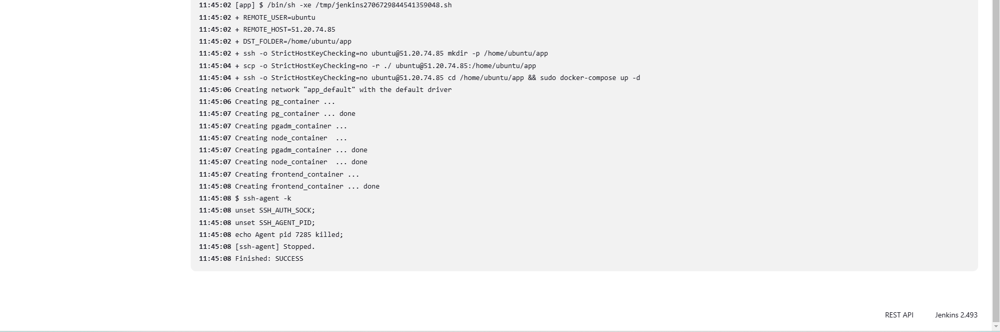
- Скрипт для запуску додатку:
```bash
REMOTE_USER=ubuntu
REMOTE_HOST=51.20.74.85
DST_FOLDER=/home/ubuntu/app

# Видалення папки, якщо вона не пуста
ssh -o StrictHostKeyChecking=no $REMOTE_USER@$REMOTE_HOST <<EOF
if [ -d "$DST_FOLDER" ] && [ "\$(ls -A $DST_FOLDER)" ]; then
    echo "Папка $DST_FOLDER не пуста. Видаляємо..."
    sudo rm -rf $DST_FOLDER
fi
mkdir -p $DST_FOLDER
EOF

# Копіювання файлів
scp -o StrictHostKeyChecking=no -r ./ $REMOTE_USER@$REMOTE_HOST:$DST_FOLDER

# Зупинка і видалення всіх запущених контейнерів
ssh -o StrictHostKeyChecking=no $REMOTE_USER@$REMOTE_HOST <<EOF
cd $DST_FOLDER
if [ "\$(docker ps -q)" ]; then
    echo "Зупинка запущених Docker-контейнерів..."
    sudo docker stop \$(docker ps -q)
    echo "Видалення Docker-контейнерів..."
    sudo docker rm \$(docker ps -aq)
fi
sudo docker-compose down
sudo docker-compose up -d
EOF
```
## 4. Налаштування декларативного пайплайну
### - У файлі deploy.Jenkinsfile описав налаштування для CI/CD. Як результат запустився додаток;
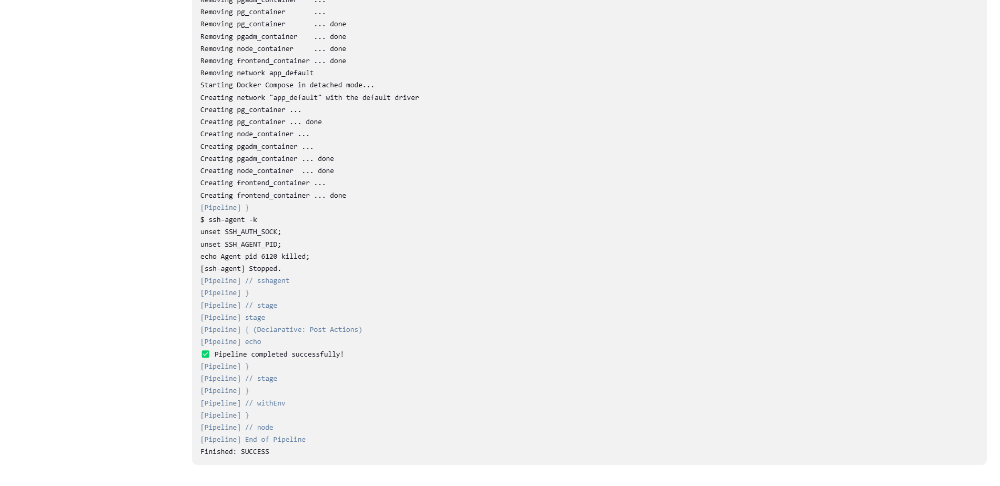