# Monitoring

## 1. Розгортання інфраструктури:
### - За допомогою terraform створив 2 сервери: app та monitoring;
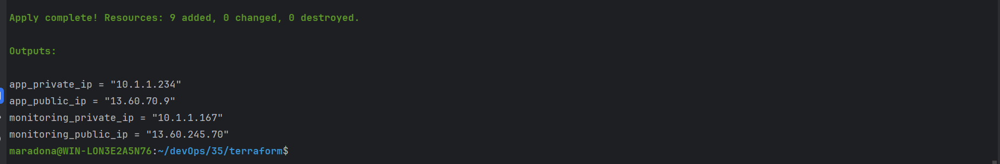
## 2. Налаштування моніторинг-серверу:
### - На сервер моніторингу за допомогою ansible-playbook monitoring.yml встановив Docker, Docker-compose, node_exporter, скопіював локальні конфіги для Grafana, Loki та Prometheus і запустив їх;
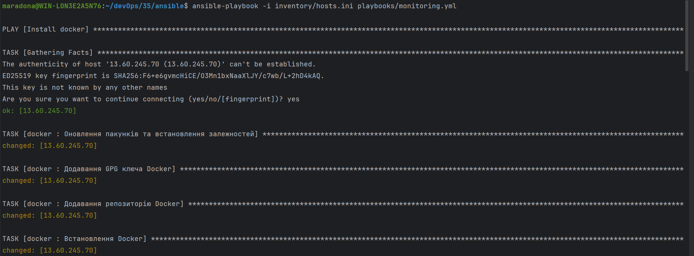
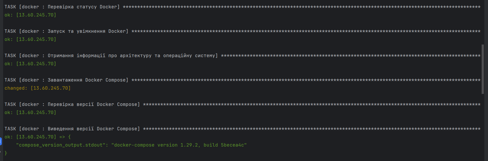
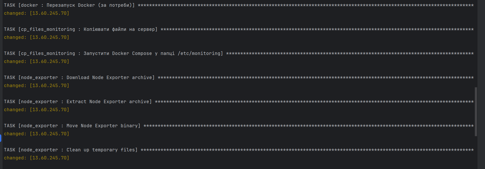
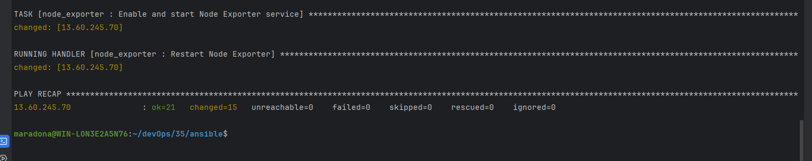

## 3. Налаштування app-серверу:
### - На app сервер за допомогою ansible-playbook app.yml встановив Docker, Docker-compose, node_exporter, скопіював конфіг для Promtail та запустив його докер образ;
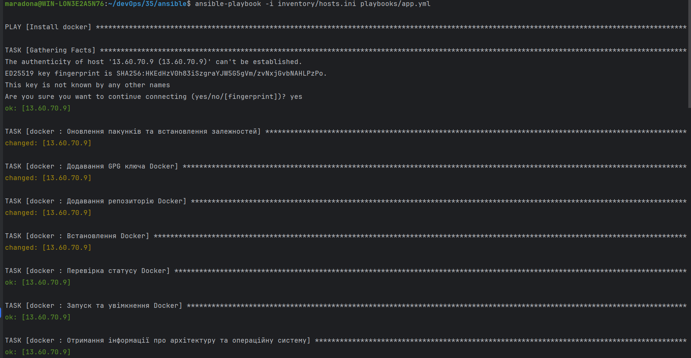
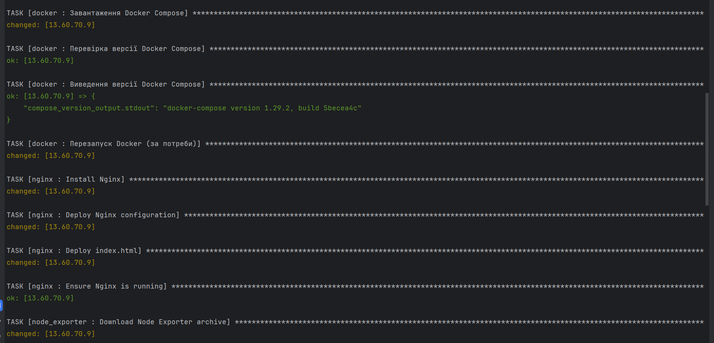
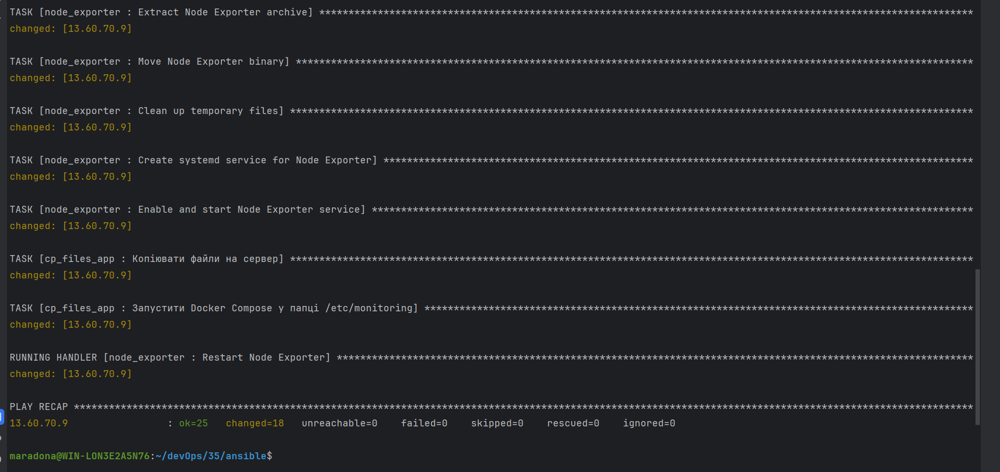

## 4. Налаштувати Grafana:
### - Додав 2 data source: Prometheus та Loki;
### - Імпортував дашборди Node Exporter, Nginx Dashboard, Loki Logs Explorer;
### - У результаті маю налаштовані метрики, що відображаються в дашборді, логи з Nginx серверу.

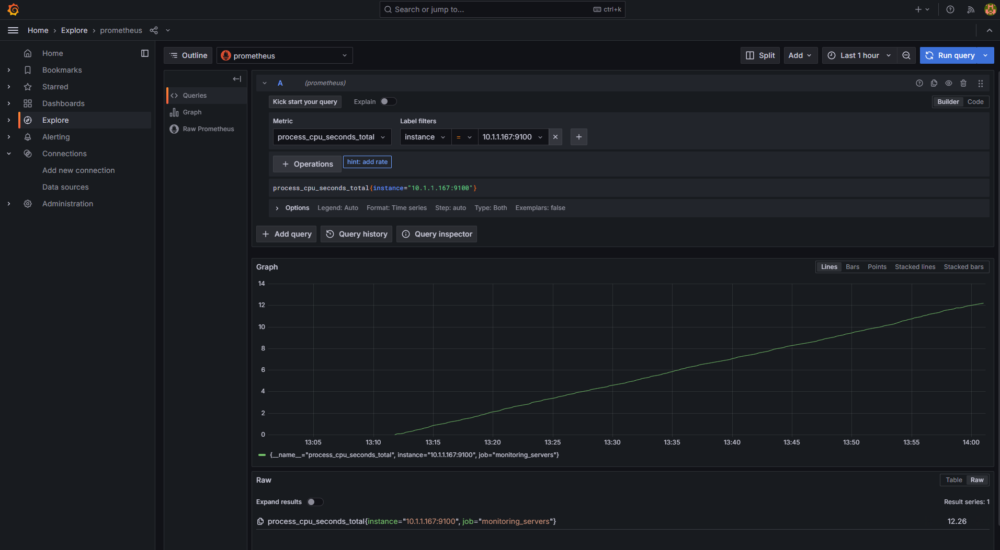
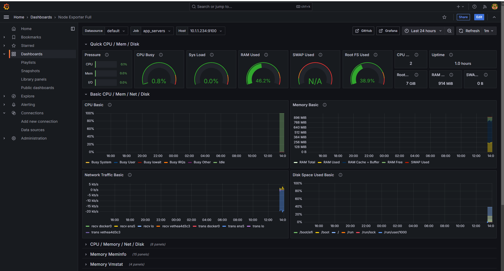
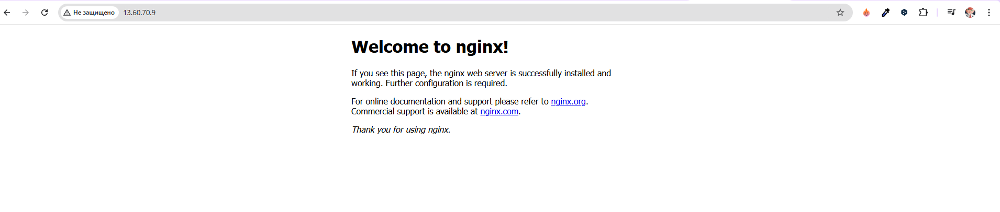
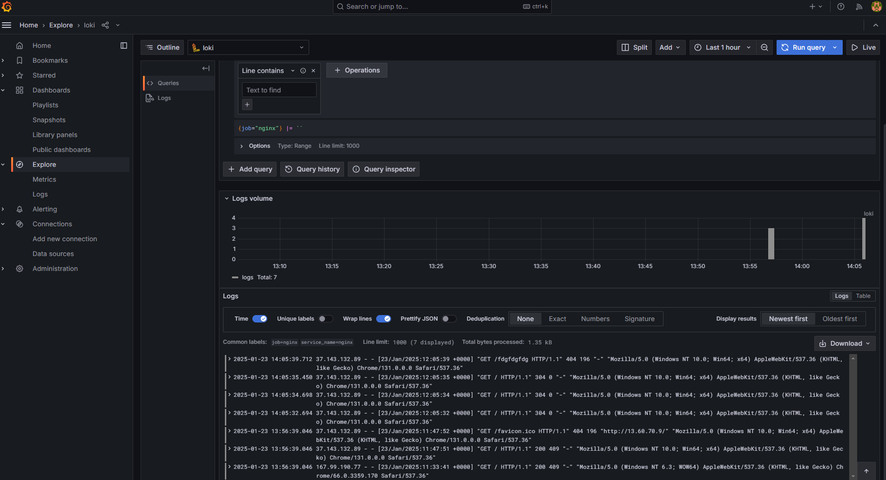