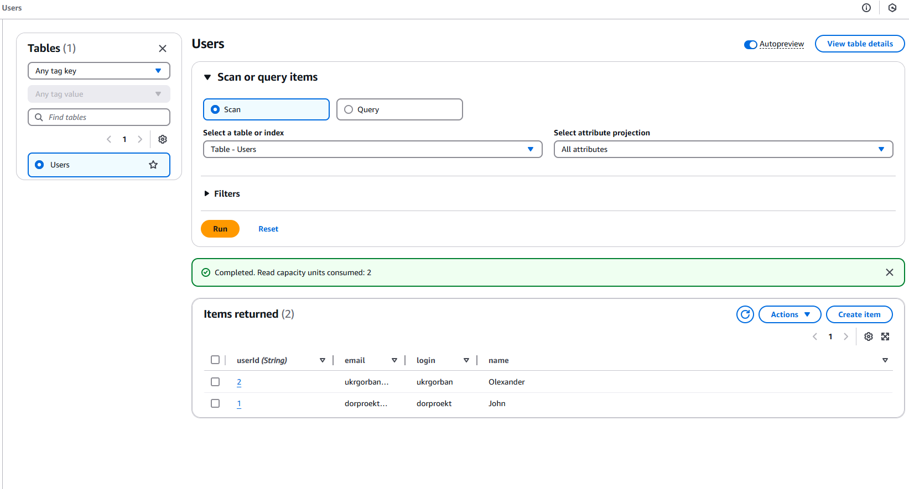
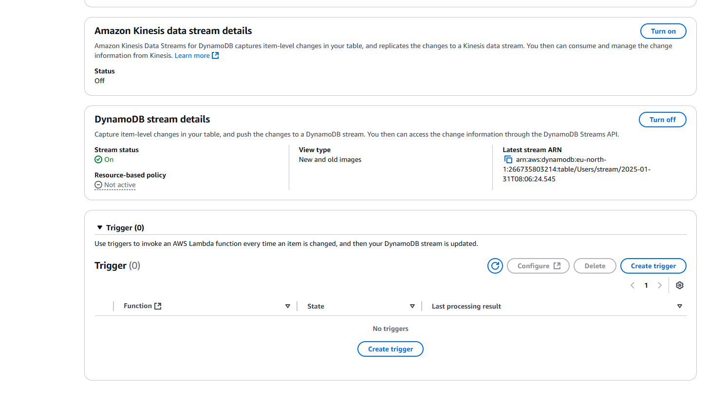
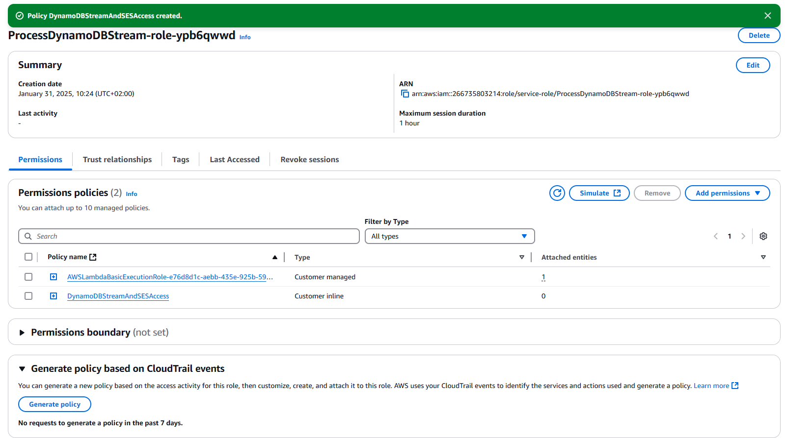
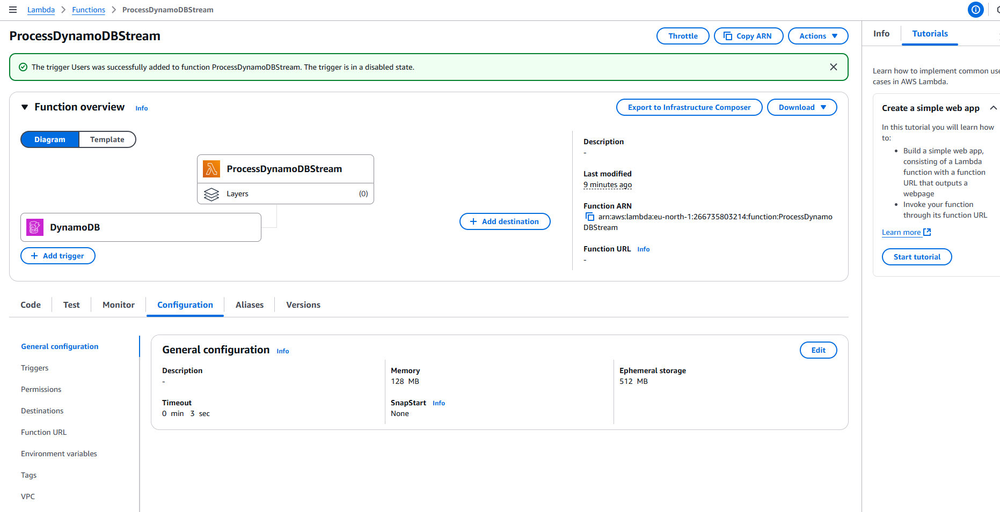
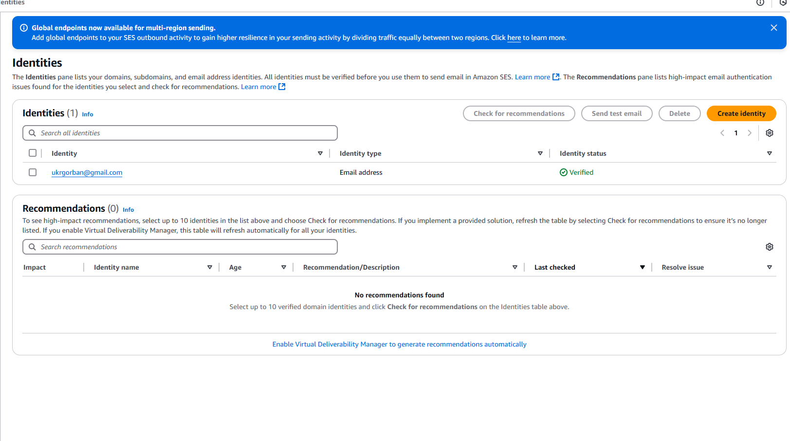
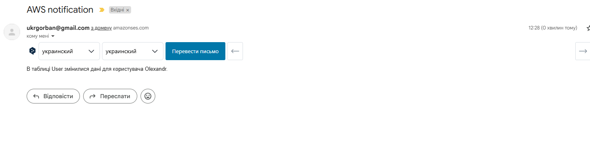
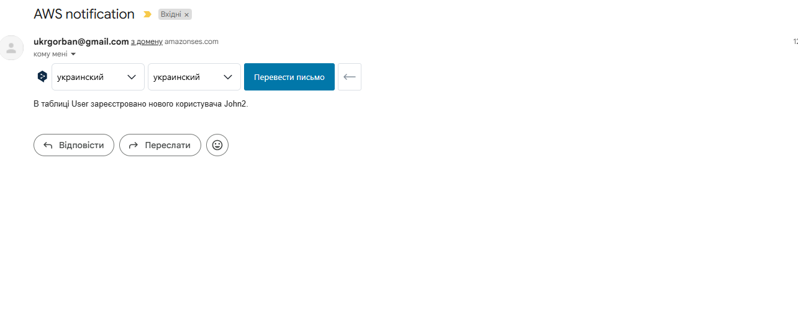

# AWS Lambda

## 1. Підготовка DynamoDB:
### - В AWS console створив таблицю Users.

## 2. Налаштування DynamoDB Streams:
### - Активував DynamoDB Streams для таблиці Users.

## 3. Створення Lambda-функції:
### - В AWS console створив нову Lambda, додав тригер та створив роль.

## 4. Налаштування Amazon SES:
### - Підтвердив електронну адресу.

## 5. Написання коду Lambda-функції
### - Створив файл index.mjs, в якому зробив обробку події створення чи редагування елементу таблиці User.
### - В результаті при додаванні або редагуванні елементу, на електронну адресу приходить відповідне повідомлення.

