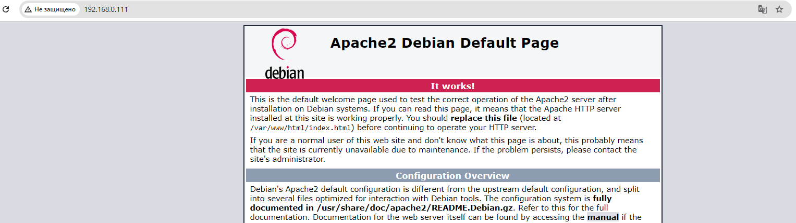
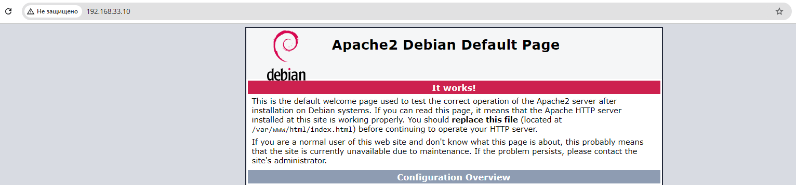
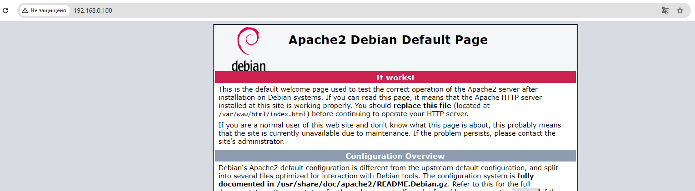

# Vagrant

##### Створив три віртуальні машини: webserver, privateserver, publicserver. На всіх серверах встановив Аpache, який відкривається по відповідним IP (webserver - динамічна адреса, privateserver - 192.168.33.10, publicserver - 192.168.0.100). Також на серверах є спільна папка в якій шеряться файли - data.

##### webserver

##### privateserver

##### publicserver

