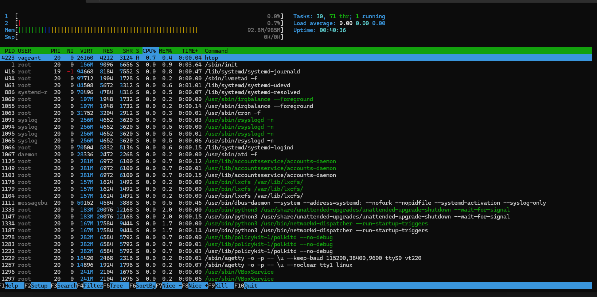

# Linux
## За допомогою Vagrant та Vagrantfile створив віртуальну машину на базі ubuntu/bionic64. 
## Там уже були встановлені VIM, GIT, HTOP. Створив SSH ключ, залив його до себе в репозитарій та потім скачав його на віртуальну машину.
## Створив файл з найпопулярнішими командами.
## Зробив скріншот htop віртуалки, на якій показані запущені процеси, завантаження процесора та пам'яті.

