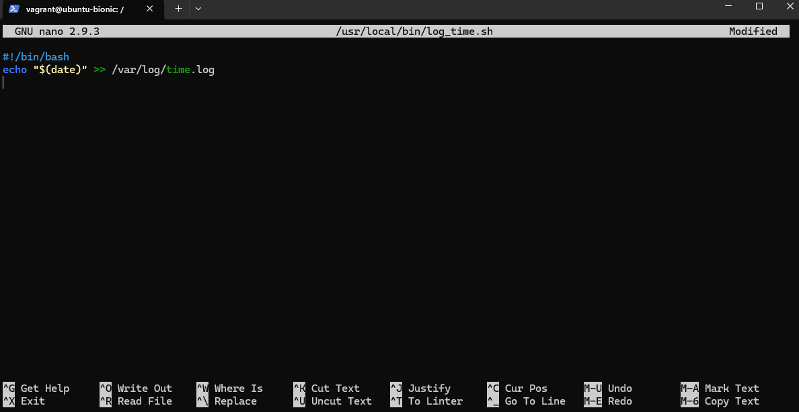
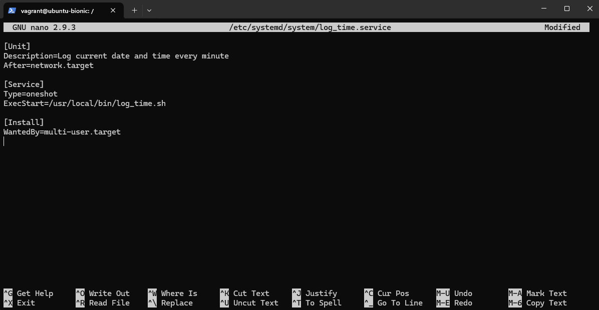
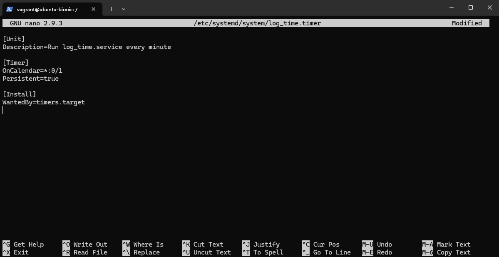
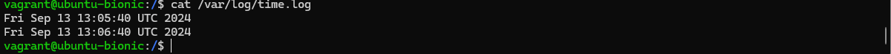

# Linux advanced

## 1. Встановити й налаштувати вебсервер Nginx через офіційний репозиторій. Додати й видалити PPA-репозиторій для Nginx, а потім повернутися до офіційної версії пакета за допомогою ppa-purge

### - Встановив Nginx через офіційний репозиторій (sudo apt update, sudo apt install nginx). Версія 1.14.0.

### - Додав PPA-репозиторій (sudo add-apt-repository ppa:nginx/stable, sudo apt update, sudo apt upgrade nginx). Версія 1.18.0.

### - Видалив PPA-репозиторій за допомогою ppa-purge (sudo apt install ppa-purge, sudo ppa-purge ppa:nginx/stable). Версія 1.14.0.

## 2. Написати й налаштувати власний systemd-сервіс для запуску простого скрипта (наприклад,скрипт, який пише поточну дату і час у файл щохвилини).

### - Створив скрипт за адресою /usr/local/bin/log_time.sh та добавив йому права на виконання sudo chmod +x /usr/local/bin/log_time.sh.

### - Створив systemd-service за адресою /etc/systemd/system/log_time.service.

### - Створив таймер для запуску скрипта щохвилини за адресою /etc/systemd/system/log_time.timer

### - Активував та запустив таймер, як результат щохвилини пишиться дата.

