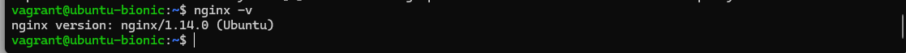
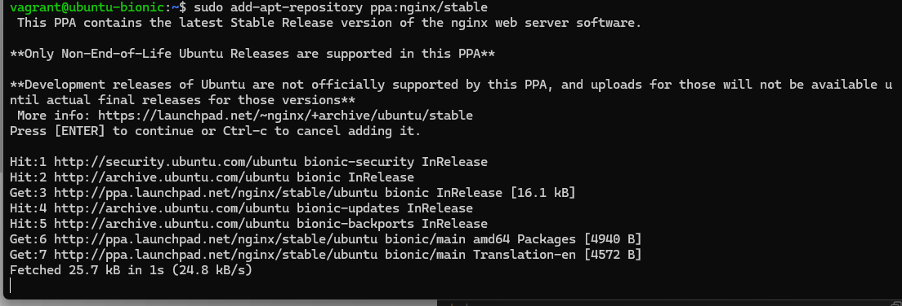
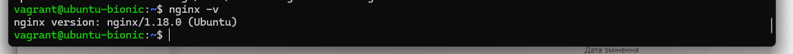
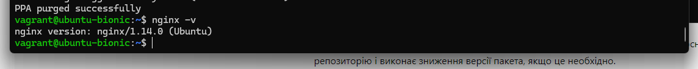

# Linux advanced

## 1. Встановити й налаштувати вебсервер Nginx через офіційний репозиторій. Додати й видалити PPA-репозиторій для Nginx, а потім повернутися до офіційної версії пакета за допомогою ppa-purge

### - Встановив Nginx через офіційний репозиторій (sudo apt update, sudo apt install nginx). Версія 1.14.0.

### - Додав PPA-репозиторій (sudo add-apt-repository ppa:nginx/stable, sudo apt update, sudo apt upgrade nginx). Версія 1.18.0.

### - Видалив PPA-репозиторій за допомогою ppa-purge (sudo apt install ppa-purge, sudo ppa-purge ppa:nginx/stable). Версія 1.14.0.

