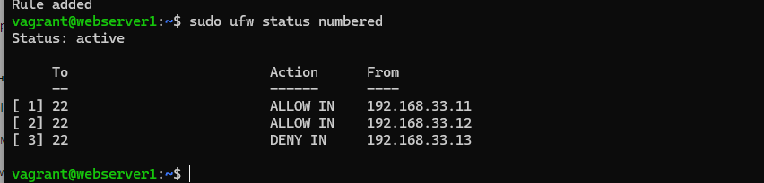
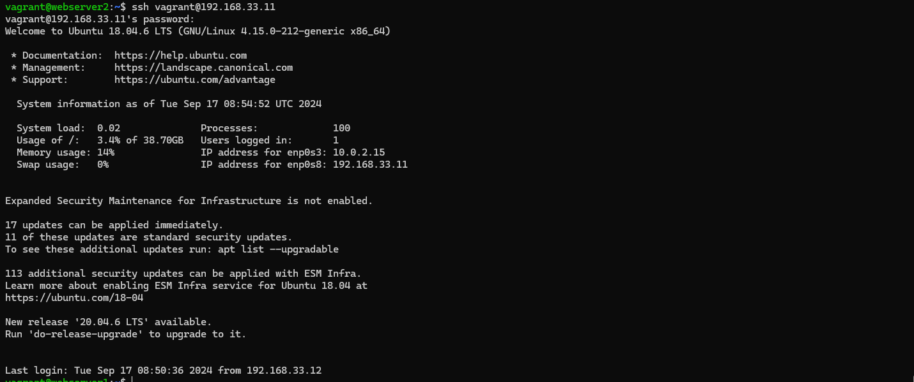
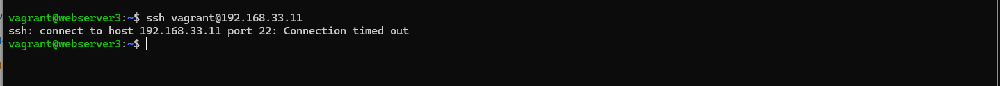
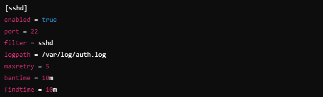
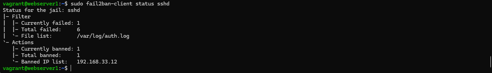

# Linux advanced

## 1. Встановити й налаштувати вебсервер Nginx через офіційний репозиторій. Додати й видалити PPA-репозиторій для Nginx, а потім повернутися до офіційної версії пакета за допомогою ppa-purge

### - Встановив Nginx через офіційний репозиторій (sudo apt update, sudo apt install nginx). Версія 1.14.0.

### - Додав PPA-репозиторій (sudo add-apt-repository ppa:nginx/stable, sudo apt update, sudo apt upgrade nginx). Версія 1.18.0.

### - Видалив PPA-репозиторій за допомогою ppa-purge (sudo apt install ppa-purge, sudo ppa-purge ppa:nginx/stable). Версія 1.14.0.

## 2. Написати й налаштувати власний systemd-сервіс для запуску простого скрипта (наприклад,скрипт, який пише поточну дату і час у файл щохвилини).

### - Створив скрипт за адресою /usr/local/bin/log_time.sh та добавив йому права на виконання sudo chmod +x /usr/local/bin/log_time.sh.

### - Створив systemd-service за адресою /etc/systemd/system/log_time.service.

### - Створив таймер для запуску скрипта щохвилини за адресою /etc/systemd/system/log_time.timer

### - Активував та запустив таймер, як результат щохвилини пишиться дата.

## 3. Налаштувати брандмауер за допомогою UFW або iptables. Заборонити доступ до порту 22 (SSH) з певного IP, але дозволити з іншого IP.

### За допомогою Vagrantfile створив три віртуальні сервери зі статичними IP (192.168.33.11, 192.168.33.12, 192.168.33.13) та налаштованими ssh по паролю.

### Увімкнув UFW - sudo ufw enable.

### Дозволив доступ по ssh 192.168.33.12 - sudo ufw allow from 192.168.33.12 to any port 22.

### Заборонив доступ по ssh 192.168.33.13 - sudo ufw allow from 192.168.33.13 to any port 22.

## 4. Налаштувати Fail2Ban для захисту від підбору паролів через SSH.

### Встановив Fail2Ban - sudo apt update, sudo apt install fail2ban.

### Скопіював конфігураційний файл sudo cp /etc/fail2ban/jail.conf /etc/fail2ban/jail.local.

### В конфігурацію добавив параметри для бану.

### Перезапустив сервіс - sudo systemctl restart fail2ban.

### З сервера 192.168.33.12 зробив 5 невдалих спроб підключитися по ssh. В результаті був забанений на 10 хвилин.

