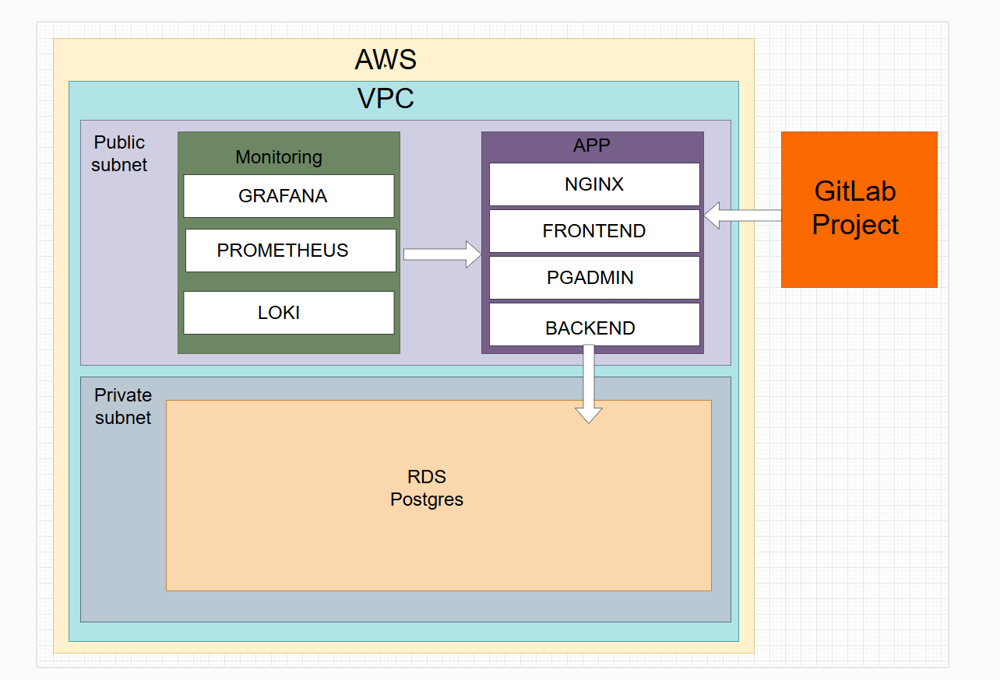

# Фінальний проект

## 1. Діаграма архітектури:

## 2. Посилання на репозиторій додатку:
https://gitlab.com/ukrgorban/catalogbooks
## 3. Розгортання інфраструктури:
`terraform init`

`terraform apply -auto-approve`

## 4. Встановлення необхідних пакетів на сервери для запуску додатку:
### - спочатку треба створити файли з паролями до БД, АPP та змінити змінну APP_SERVER в репозитарію;
`ansible-playbook -i inventory/hosts.ini playbooks/app.yml`

`ansible-playbook -i inventory/hosts.ini playbooks/monitoring.yml`

## 5. Робимо commit в репозитарію.